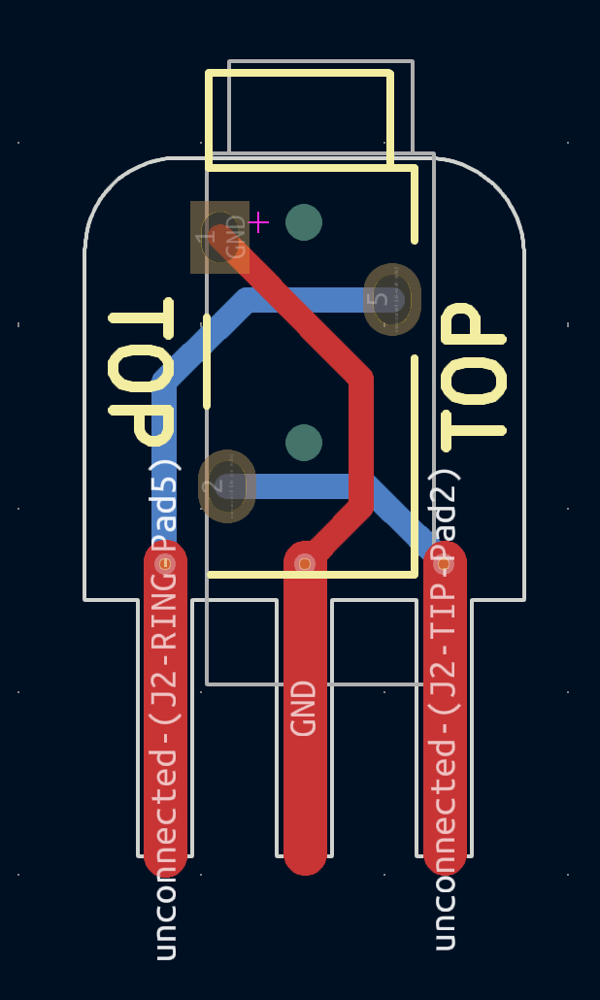
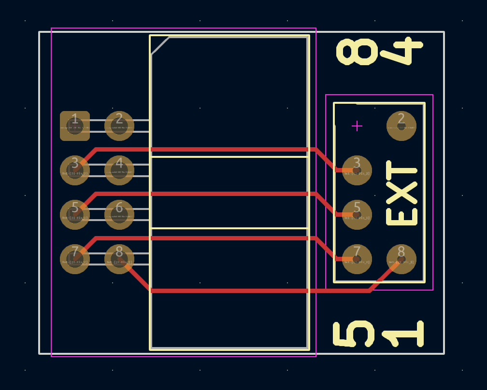

# Accessories:
 - Gerbers (.zip) files needed for PCB manufacturing listed above.
    - 1.0mm PCB Thickness preferred for gscart_ext_conenctor
    - 1.6mm for all others
    - For Surface Finish, "HASL(with lead)" is fine
    - Option to "Remove Mark" is free now on JLCPCB
    - All remaining default options should be fine
    - Let me know if you have any questions!
 - gscart/gcomp EXT, TESmart HDMI, and alt Extron connectors are showcased in the main README

 ### TESmart_connector
  - BOM listed on Main README
 

 ### gscart_ext_connector (gcomp too!)
  - BOM listed on Main README
 
