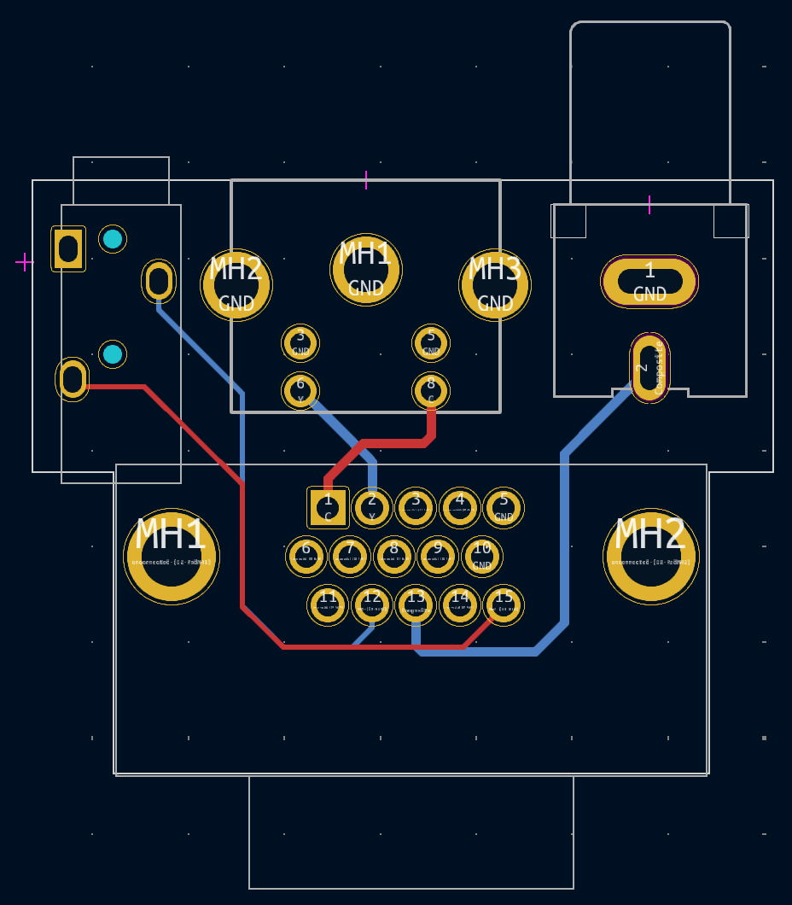
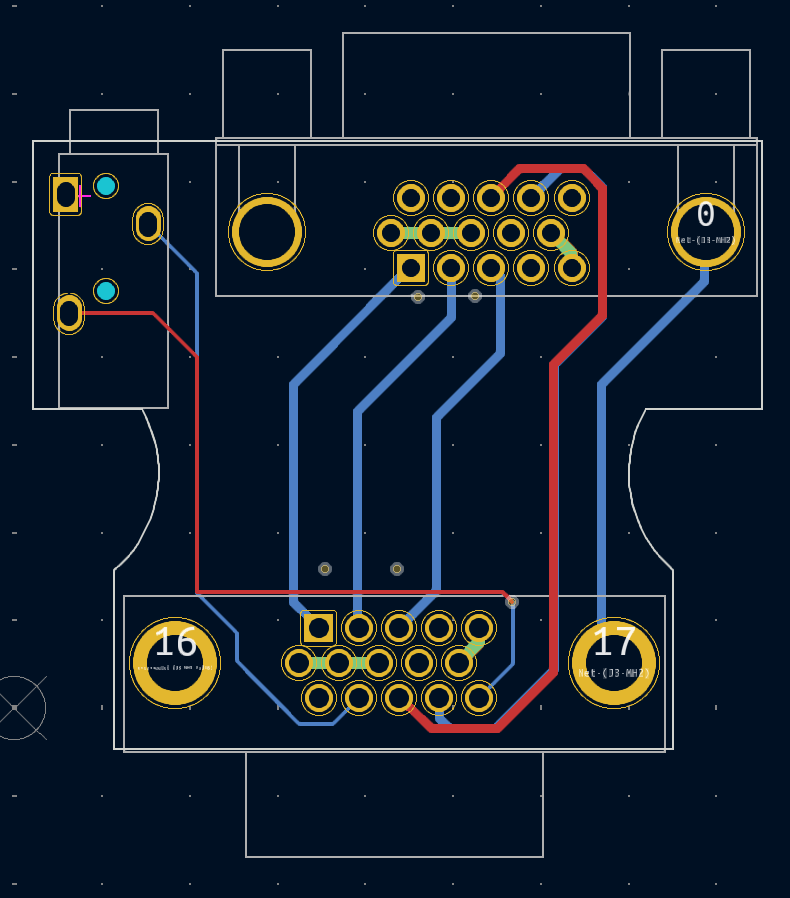

# VGA Adapters for use with the Donut Dongle:
Gerbers (.zip) files needed for PCB manufacturing listed above.
 - 1.6mm PCB Thickness
 - For Surface Finish, "HASL(with lead)" is fine
 - Option to "Remove Mark" is free now on JLCPCB
 - All remaining default options should be fine
 - Let me know if you have any questions!

### YC2VGA_wSerial 
 - 4 Layer design
 - Adds the bonus of converting the VGA port into Enhanced S-video and Composite inputs.
 - Pushon connector is nice and snug, no need for jackscrews.
 - BOM listed on Main README

### VGAPassthrough_wSerial
 - 4 Layer design
 - Passes signals through untouched to the VGA port.
 - Designed for use with #4-40 x 3/4" jackscrew "bolts" for heavier VGA cable support.
 - BOM listed on Main README

