# Donut Dongle
 - **v1.1 - added TESmart 16x1 control via RT4K remote. See .ino Options section for details.**<br/><br/>

**Arduino Nano based hub that connects your digital and analog console switching setup with the RetroTink 4K and/or RetroTink 5x / OSSC for Auto Profile switching**

[!NOTE] If DIY is not your thing. I have assembled versions for gScart/gComp and TESmart/Extron/etc available in my Ko-Fi shop.

The Donut Dongle connects to a switch in a way that allows it to see which port is active. When a console powers on (auto-switching) or an input is manually selected, the Donut Dongle sends a serial command to the RetroTink 4k (or IR signal to the RT5x, OSSC) telling it to load a profile. For the RT4K, the profiles can either be defined as remote profiles; those configured in the menu for the remote buttons. Or they can be SVS profiles which are configured on the RT4K's SDcard. <br />

For details, refer to the ["How to Use"](https://github.com/svirant/DonutDongle/tree/main/README.md#how-to-use) section below.

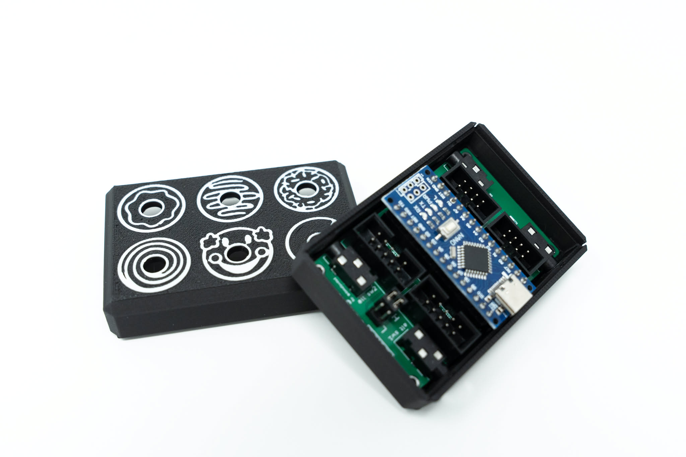
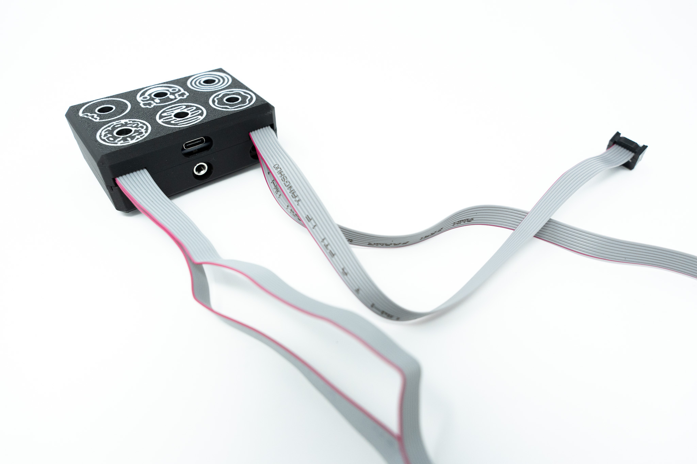
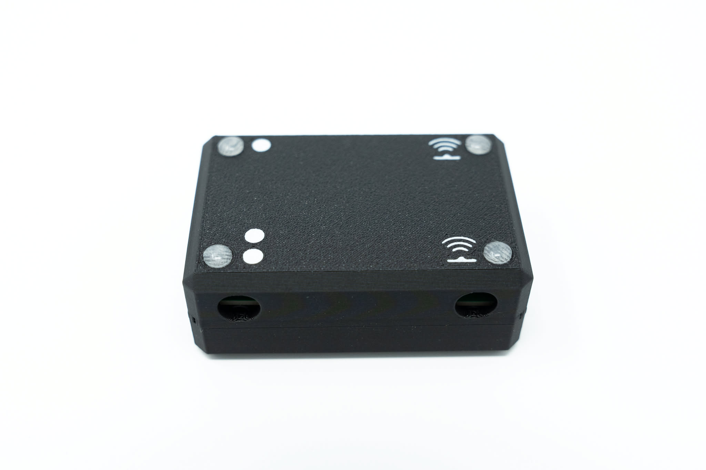


### [More Images...](https://photos.sixteenbit.app/share/KXUwNPO2uvjenoCdj3gsQnEMd4q5h4ymUv-0fc8PItIhjA8JXHlVgPDeFnTRXM76KPM)

<br />

# Thanks to 
 - [Justin Peacock](https://byjustin.me/) for the amazing case design
 - HerraAAV3 from the RetroTink discord for the VGA Adapter case design
 - [Mike Chi](https://retrotink.com) for help with the open drain serial bits
 - [@niquallis](https://x.com/niquallis), [@UstSte](https://x.com/UstSte), and last but not least [Aru](https://x.com/CielFricker249) for beta testing

<br />


# Supported Switches
(current list, but not limited to)
| **Switch**    | Supported | Notes |
| ------------- | ------------- |------------- |
| MT-VIKI 8 port HDMI | yes, confirmed first hand. Auto-switching Profiles work and RT4K remote can also change inputs and profiles w/ AUX8 + profile button 1 - 8.  | Front case buttons and included IR remote do not generate serial output on the switch itself therefor profile changes can't happen for these 2 other methods.  |
| TESmart 16x1 HDMI  | yes, confirmed first hand  ||
| gSCARTsw / gCOMPsw | **version 5.x** confirmed by [@niquallis](https://x.com/niquallis) and [@UstSte](https://x.com/UstSte), thanks so much for your help! | Manual input selection works too! |
| Extron RGBHV sw6  | yes, confirmed first hand  | |
| Extron DXP 88 | yes, confirmed first hand | at the moment, works with Presets only. Preset 1 is Profile/SVS 1. On Extron sw2 port Preset 1 is SVS 101, etc|
| Extron CrossPoint, MVX, etc | same as DXP 88 above. at the moment, Presets only |
| Otaku Games Scart 10 | Jumper moved to "L" and with required [mod](https://github.com/svirant/RT4k_HD15_serial_control/tree/main/Otaku%20Games%20Scart%20Switch) | modded switch works on its own, but the Donut Dongle would allow you to connect 2x to the RT4K along with up to 2x gscart/gcomp|

<br />

# Connections
  - Connect 4 switches Total
    - 2x gscart/gcomp
    - 2x Extron, 2x TESmart, or 1 of each
  - 1x usb-c port for power/programming (on Arduino Nano)
  - 1x 3.5mm "TX OUT to Retrotink 4K VGA adapter" port
  - 1x IR Emitter (required for OSSC, RT5x (RT5x must be on firmware version 3.7 or higher))
  - 1x IR Receiver (optional for better reception and IR remote customizations)


<br /><br />

# Layout Example
 - **TESmart 16x1 HDMI switch & 2x gSCART/gCOMP**
    - **VGA Passthrough adapter**
    - **TESmart adapter**
    - **gScart EXT pushpin adapter**


<br />
<br />

 - **Case closed**
   - **ribbon cables fold over and come out slots in the back of case**

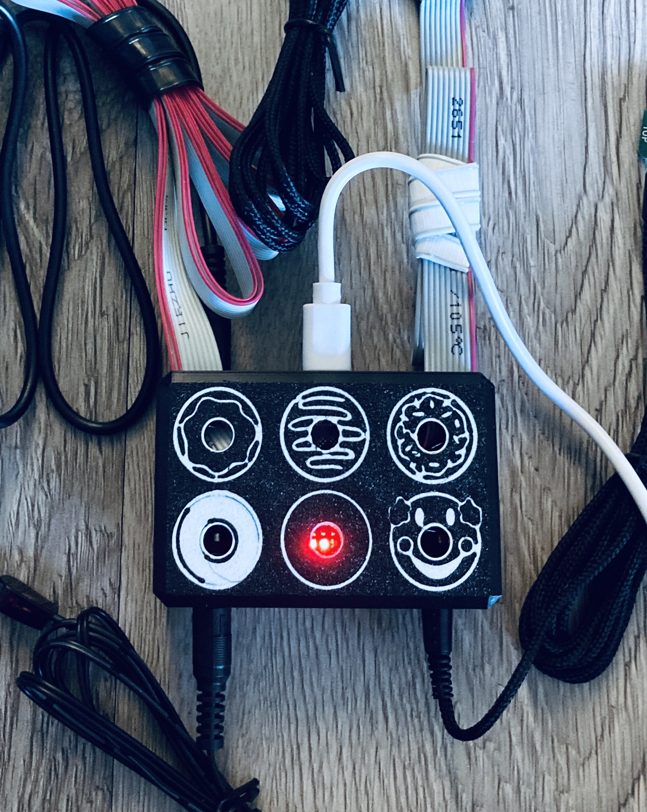
<br /><br />


# Connection Acccessories

**gscart/gcomp EXT connector (plug-n-play)**<br />
The spring pins allow it to stay "sandwiched" in place by the lid<br />
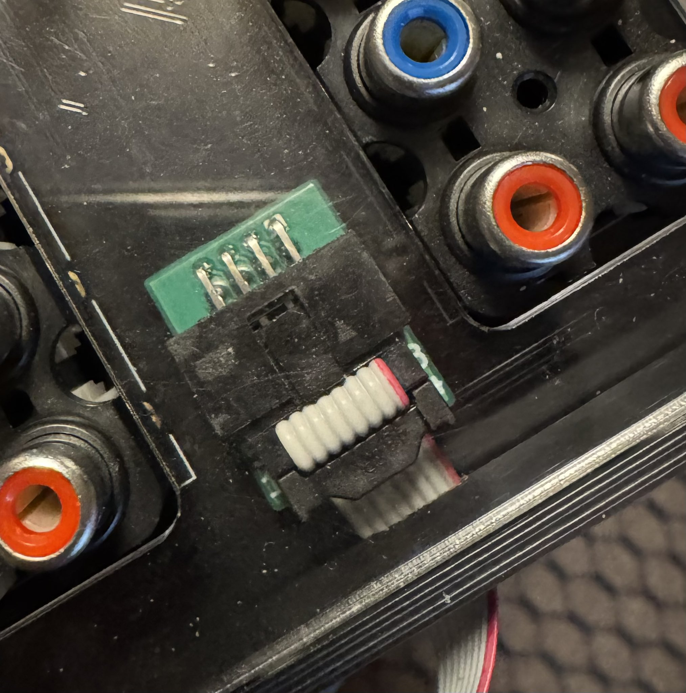

<br />

**TESmart connector**<br />


**Alternate Extron connection type:**
   - **DB9 male to 3.5mm (connects to alt sw1 / alt sw2 port instead of 2x5 header)**
   - **Higher quality and much longer cord than the standard 2x5 cable**


**Parts listed in [BOM](https://github.com/svirant/DonutDongle/tree/main/README.md#connection-accessories) below**

----------------
# New IR Remote Control functionality
When using the optional IR Receiver, the IR reception of the RT4K can be been greatly enhanced. You can think of it as an IR repeater, but instead talks to the RT4K via Serial for solid communication. Since the Donut Dongle is in the middle, other remote features can be added such as:
 - Normally, if you power on your console before waking the RT4K, the RT4K will have not seen the profile change. Using the remote's POWER button, in this configuration, will wake the RT4K "and" resend the profile after it's finished waking.

 - AUX8 button + Power button power cycles your TV via IR Emitter. (only LG OLED CX atm, more can be added upon request)

 - AUX8 button + profile button 1 - 12 loads SVS profiles of your choosing. By default is SVS 1 - 12

 - AUX8 pressed twice, manually enter a SVS profile to load with the profile buttons using 1 - 9 and 10,11,12 buttons for 0. Must use 3 digits. Ex: 001 = 1, 010 = 10, etc
 
 - MT-ViKI 8 Port HDMI switch's inputs can be changed with profile buttons 1 - 8. Must enable "MTVIKIir" in the options section of the .ino

 - TESmart 16x1 HDMI switch's inputs can changed. Must set "TESmartir" in the options section.
    - AUX7 + button 1 - 12, aux1, aux2, aux3, aux4 for inputs 1 - 16 on "alt sw1" port (SVS profiles 1 - 16)
    - AUX8 + button 1 - 12, aux1,aux2,aux3,aux4 for inputs 1 - 16 on "alt sw2" port (SVS profiles 101 - 116)

**gScart / gComp Control** (must set gctl = 1 in Options, Only supported on vers 5.x switches)

 - AUX5 button + profile button 1 - 8 button selects corresponding input on gscart sw1
    - AUX5 button + profile button 9 - 12 button to return to auto switching

 - AUX6 button + profile button 1 - 8 button selects corresponding input on gscart sw2
    - AUX6 button + profile button 9 - 12 button to return to auto switching

 - RT5x and OSSC may require a repeat of the button combos
 
 <br />

Let me know what ideas you have, and perhaps I can add them in.

**Note:** To stop the RT4K from responding twice (once from the built-in IR sensor and once from the Donut Dongle), place the included "ir_remote.txt" on the root of the SDcard. This remaps the builtin IR for every button except POWER to the RT5x remote. This way you can still use the POWER button to power on the RT4K but will stop it from responding from all other button presses.


# Ordering PCBs
PCBs for this project:
 - [Donut Dongle](https://github.com/svirant/DonutDongle/blob/main/RT4K_donut_dongle.zip)
 - [VGA Adapter](https://github.com/svirant/DonutDongle/tree/main/Adapters) (VGAPassthrough or YC2VGA)
 - (Optional) [TESmart_connector](https://github.com/svirant/DonutDongle/tree/main/Accessories)
 - (Optional) [gscart_ext_connector](https://github.com/svirant/DonutDongle/tree/main/Accessories) (works for gcomp too!)
 
There are plenty of options for PCB manufacturing but I prefer [JLCPCB](https://jlcpcb.com) (No affiliation). Using the gerber (.zip) files provided, it's easy to place an order. Below are some tips/guidelines:
- 1.0mm PCB Thickness for gscart_ext_connector.zip
- 1.6mm for all others
- For Surface Finish, "HASL(with lead)" is fine
- 4 Layer PCBs are the same cost as 2 Layer for the VGA Adapters. Because of that, the inner 2 layers are being used as ground planes for better EMI protection. Thanks to https://x.com/zaxour for the idea!
- "Remove Mark" option is now free on JLCPCB. Use it!
- All remaining default options should be fine
- Let me know if you have any questions!

# Assembly
**v1.0 (RC2 is now v1.0)**<br /><br />
[Interactive HTML BOM](https://svirant.github.io/DonutDongle/images/ibom.html)

[](https://svirant.github.io/DonutDongle/images/ibom.html)
[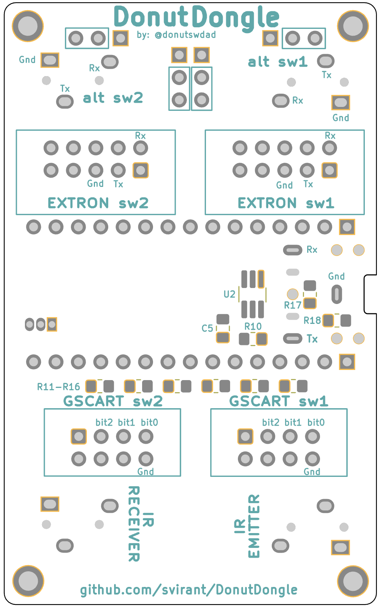](https://svirant.github.io/DonutDongle/images/ibom.html)

# PCB
**v1.0**

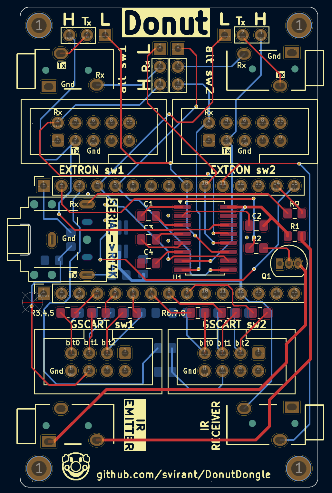
<br /><br />

# Schematic
**v1.0**

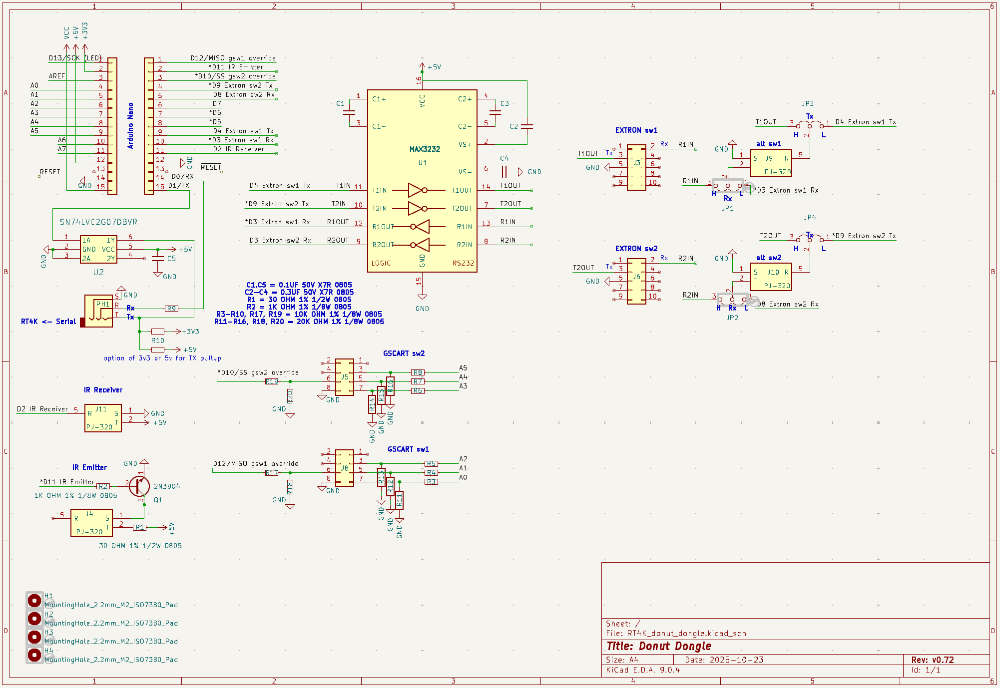
<br /><br />

## Bill of Materials (BOM)
### [- 3D Printed Dount Dongle Case](https://makerworld.com/en/models/1154283#profileId-1159282)
### [- 3D Printed VGA Adapter Case](https://github.com/svirant/DonutDongle/tree/main/Adapters) [Courtesy of HerraAAV3 on the RetroTink Discord]
### [- Digikey shared list](https://www.digikey.com/en/mylists/list/53XEHTQZJK)
### [- AliExpress wish list](https://www.aliexpress.com/p/wish-manage/share.html?smbPageCode=wishlist-amp&spreadId=09A40E28BA67E42DE9AF29A70E7238263DE305046632ABE9A0D5E1C5C4589AD9)
<br />

* **Donut Dongle PCB**

| **Qty**    | Designation | Part |  Link  |  Notes |
| ------------- | ------------- |------------- |------------- |------------- |
| 5  | C1-C5 | 0.1 uf / 100nf 50V X7R 0805 Capacitor| [Digikey](https://www.digikey.com/en/products/detail/yageo/CC0805KRX7R9BB104/302874?s=N4IgTCBcDaIMwEYEFokBYAMrkDkAiIAugL5A) | |
| 1  | R1 | 30 OHM 1% 1/2W 0805 Resistor | [Digikey](https://www.digikey.com/en/products/detail/panasonic-electronic-components/ERJ-P06F30R0V/9811718) | |
| 1  | R2 | 1K OHM 1% 1/8W 0805 Resistor | [Digikey](https://www.digikey.com/en/products/detail/yageo/RC0805FR-071KL/727444) | |
| 10  | R3 - R10, R17, R19 | 10K OHM 1% 1/8W 0805 Resistor | [Digikey](https://www.digikey.com/en/products/detail/yageo/AC0805FR-0710KL/2827834) | |
| 8  | R11 - R16, R18, R20 | 20K OHM 1% 1/8W 0805 Resistor | [Digikey](https://www.digikey.com/en/products/detail/yageo/RC0805FR-0720KL/727720) | |
| 1  | Q1 | 2N3904 NPN Transistor | [AliExpress](https://www.aliexpress.us/item/3256806623522970.html) | |
| 1  | U1 | MAX3232 SOP-16 RS-232 Interface IC | [AliExpress](https://www.aliexpress.us/item/3256807314260762.html) | |
| 1  | U2 | IC BUF NON-INVERT 5.5V SOT23-6 | [Digikey](https://www.digikey.com/en/products/detail/texas-instruments/SN74LVC2G07DBVR/486427) or [alternate](https://www.digikey.com/en/products/detail/umw/SN74LVC2G07DBVR/24889644)| |
| 1  | PH1 | PJ-307 3.5mm Stereo Jack | [AliExpress](https://www.aliexpress.us/item/3256805624175150.html) | |
|    | |  or **1x** 3.5mm Audio Jack Socket | [AliExpress](https://www.aliexpress.us/item/2251832685563184.html) | Like the PJ-307 but missing the inner 2 poles which arent needed anyways |
| 4  | J4,J9-11 | PJ-320 3.5MM Headphone Jack Audio Video Female | [AliExpress](https://www.aliexpress.us/item/3256807448104402.html) | Color: PJ-320B DIP | 
| 2  | J3,J6 | 2x5 Pin Double Row 2.54mm Pitch Straight Box Header | [AliExpress](https://www.aliexpress.us/item/3256805177947724.html) | (Color: STRAIGHT TYPE, Pins: 10PCS DC3-10Pin) |
| 2  | J5,J8 | 2x4 Pin Double Row 2.54mm Pitch Straight Box Header | [AliExpress](https://www.aliexpress.us/item/3256805177947724.html) | (Color: STRAIGHT TYPE, Pins: 10PCS DC3-8Pin) |
| 1  | (optional) | 3.5mm CHF03 1.5 Meters IR Infrared Remote Emission Cable | [AliExpress](https://www.aliexpress.us/item/3256805962345169.html) | required for OSSC, RT5X (must be firmware version 3.7+) |
| 1  | (optional) | 3.5mm Infrared Remote Control Receiver Extension Cable | [AliExpress](https://www.aliexpress.us/item/2251832741040177.html) | required for [New IR Remote Control functionality](https://github.com/svirant/DonutDongle?tab=readme-ov-file#new-ir-remote-control-functionality) |
| 2  | H1,H2 | 2.54mm Pitch Single Row Female 15P Header Strip | [AliExpress](https://www.aliexpress.us/item/3256801232229618.html) | |
| 1  | | Any 3.5mm / aux / stereo / trs / cable | [AliExpress](https://www.aliexpress.us/item/2255799962255486.html) | |
| 1  | | usb-c cable for Arduino power & initial programming | [AliExpress](https://www.aliexpress.us/item/3256806983355947.html) | |
| 1  | | Arduino Nano type c | Support [RetroRGB!](https://amzn.to/4gnHqN4) | Make sure the headers and esp the 2x3 pins are not soldered. |
| 1  | JP2 | 2x3 Pin Double Row 2.54mm Pitch Header | | Use the one that comes with the Arduino Nano. Jumper "H" for all switches unless instructed otherwise. |
| 2  | JP3,4 | 1x3 Pin Single Row 2.54 Pitch Header | | Dont buy two 1x3. Find any single row header and break off two 1x3 sections. Jumper "H" for all switches unless instructed otherwise. |
| 4  | | 2.54mm Jumper | [AliExpress](https://www.aliexpress.us/item/2255800354403384.html) | You can also just solder blob "H". "L" jumper setting has only 1 use case atm. |

* **Switch connection Cables**

| **Qty**    | Switch Type | Part |  Link  |  Notes |
| ------------- | ------------- |------------- |------------- |------------- |
| 1 or 2 | **TESmart HDMI** | Any 3.5mm / aux / stereo / trs / Cable | [AliExpress](https://www.aliexpress.us/item/2255799962255486.html) | strip 1 end to expose red(Rx)/white(Tx)/gnd wires for the green screw clamp OR use the TESmart_connector shown below|
| 1 or 2 | **GscartSW/GCompSW** | 2x4 Pin Double Row 2.54 Pitch Angled Box Header | [AliExpress](https://www.aliexpress.us/item/3256805177947724.html?) | (Color: RIGHT ANGLE TYPE, Pins: 10PCS DC3 8Pin), Solders onto EXT port. Or use the gscart_ext_connector shown below.  |
|1 or 2 | **GscartSW/GCompSW** | 2x4 Pin Female Header Ribbon Cable | [AliExpress](https://www.aliexpress.us/item/3256804576275377.html?) | (Pins: 2x4Pin, Color: Any length) |
| 1  | **Extron** | 2 Port DB9 to 2x5 Pin Female Header Ribbon Cable | [AliExpress](https://www.aliexpress.us/item/3256807472891897.html) | |
| | | or **2x** DB9 Male to 3.5mm Male Serial RS232 Cable 6feet | [Amazon](https://www.amazon.com/LIANSHU-DC3-5mm-Serial-RS232-Cable/dp/B07G2ZL3SL/) | "MUST" be wired as so: [DB9 Male Pin 5 -> Sleeve, DB9 Male Pin 2 -> Tip, DB9 Male Pin 3 -> Ring](/images/7.png) |
 


### At least 1 of the following [VGA adapters](https://github.com/svirant/DonutDongle/tree/main/Adapters) is required:

* **YC2VGA w/ Serial Tap v2: (enhanced s-video and composite as a bonus)**

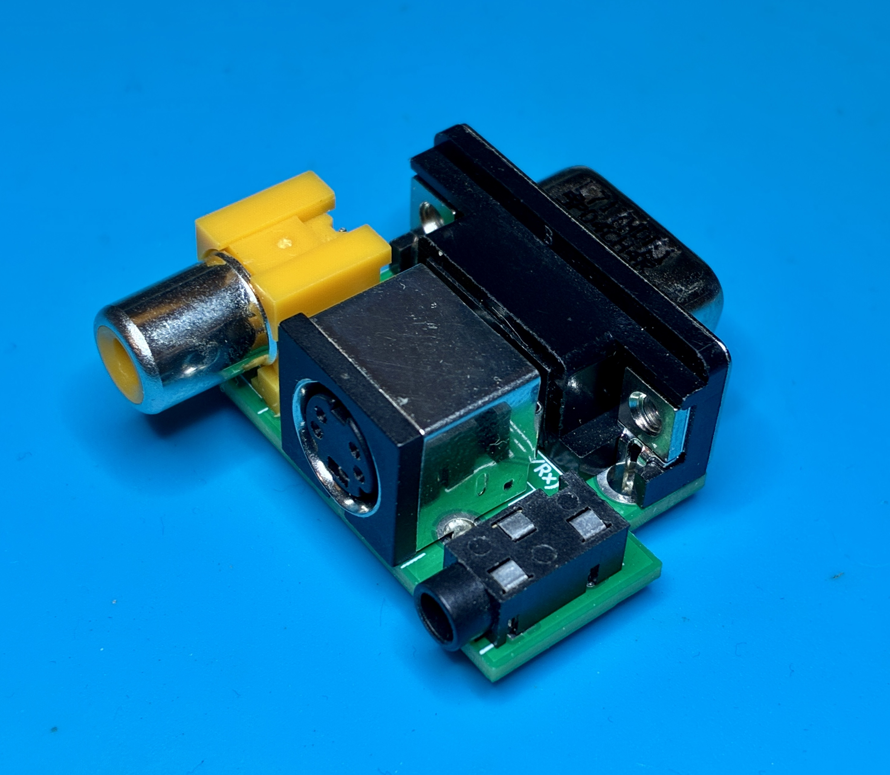<br />

| **Qty**    | Part |  Link  |  Notes |
| ------------- | ------------- |------------- |------------- |
| 1  | Yellow RCA Composite jack | [AliExpress](https://www.aliexpress.us/item/3256805949533421.html) | (Color: Yellow) |
| 1  | S-Video jack | [AliExpress](https://www.aliexpress.us/item/3256804041313042.html) | (Color: A 4Pin) |
| 1  | PJ-320 3.5MM Headphone Jack Audio Video Female | [AliExpress](https://www.aliexpress.us/item/3256805995568762.html) | (Color: 10PCS PJ-320) |
| 1  | VGA Male Connector [L717HDE15PD4CH4R-ND] | [Digikey](https://www.digikey.com/en/products/detail/amphenol-cs-commercial-products/L717HDE15PD4CH4R/4886543) | |
 
* **VGA Passthrough w/ Shared Serial Tap:**
   - Confirmed compatible with the Scalable Video Switch and it's auto profiles.

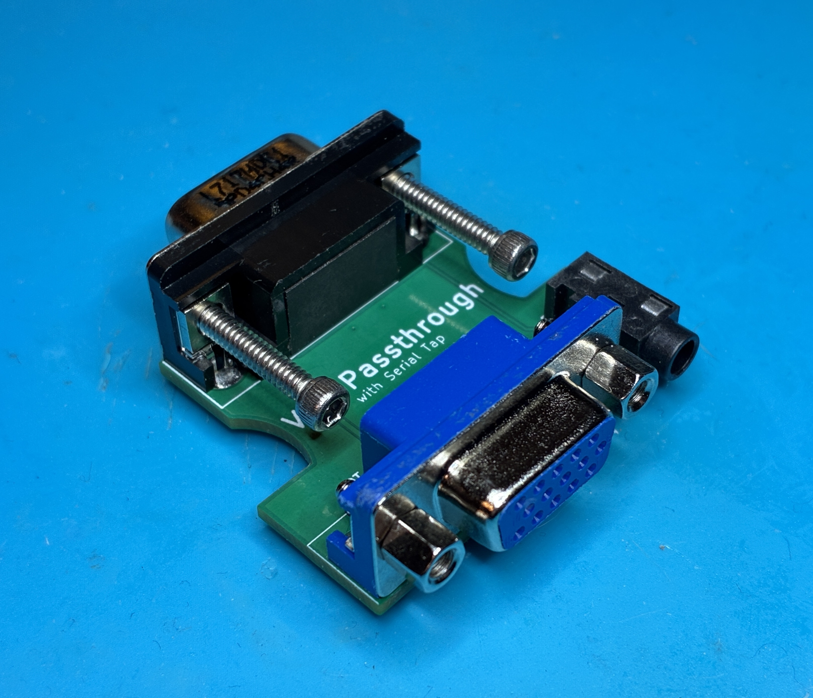
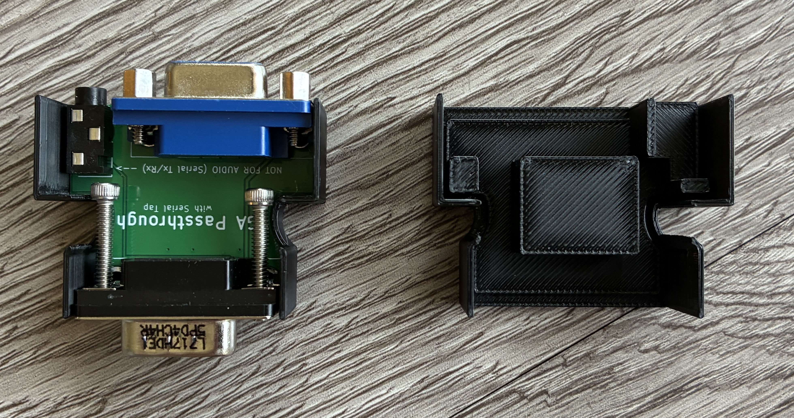<br />
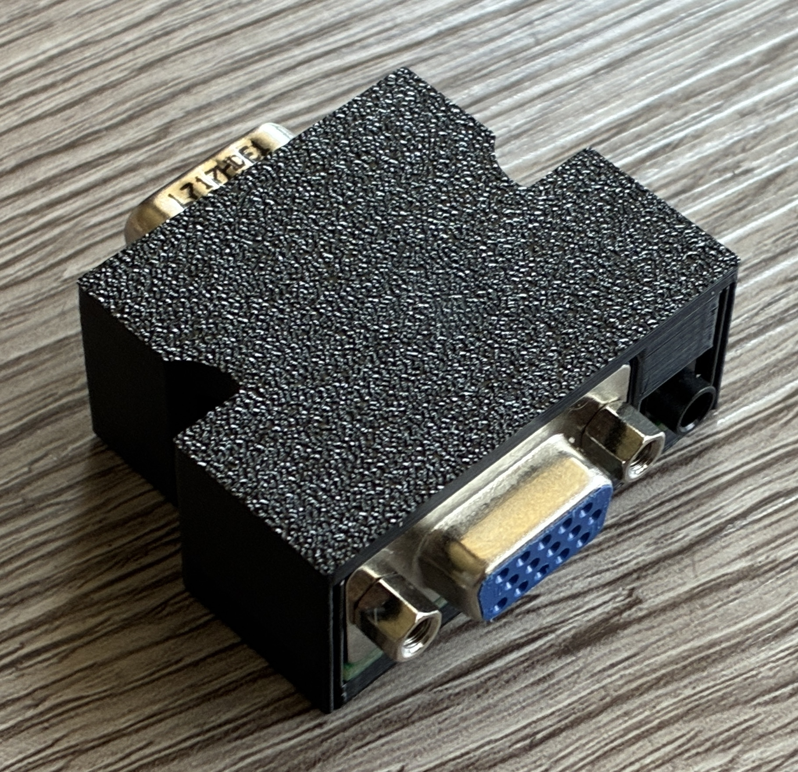
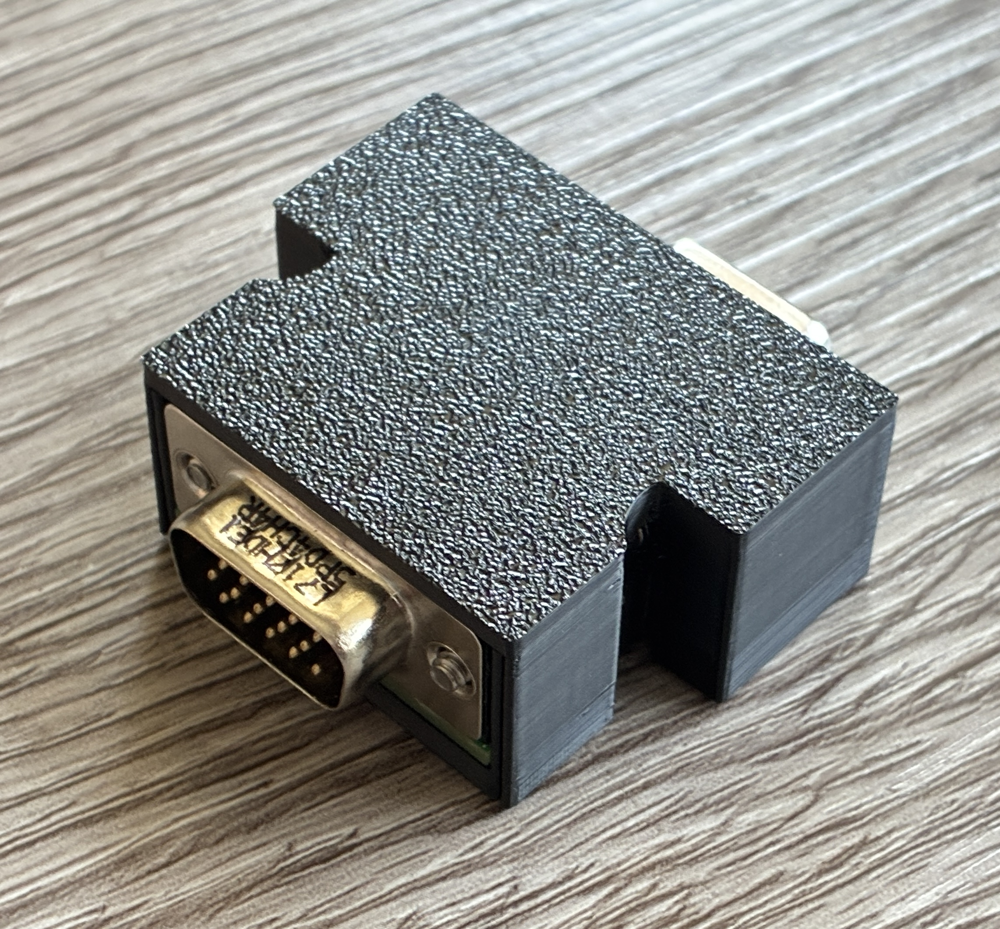<br />


| **Qty**    | Part |  Link  |  Notes |
| ------------- | ------------- |------------- |------------- |
| 1 | VGA Male Connector [L717HDE15PD4CH4R-ND] | [Digikey](https://www.digikey.com/en/products/detail/amphenol-cs-commercial-products/L717HDE15PD4CH4R/4886543) | |
| 1 | VGA Female Connector | [AliExpress](https://www.aliexpress.us/item/3256807197056325.html) | (Color: DB15 3.08) |
| 1 | PJ-320 3.5MM Headphone Jack Audio Video Female | [AliExpress](https://www.aliexpress.us/item/3256805995568762.html) | (Color: 10PCS PJ-320) |
| 2 | #4-40 x 3/4" screw (optional) | [Ebay](https://www.ebay.com/itm/222577369468) | |

  ### Connection Accessories (optional)

  * **gscart/gcomp EXT connector**

| **Qty**    | Part |  Link  |  Notes |
| ------------- | ------------- |------------- |------------- |
| 1 | 2x4 Pin Double Row 2.54 Pitch Angled Box Header | [AliExpress](https://www.aliexpress.us/item/3256805177947724.html?) | (Color: RIGHT ANGLE TYPE, Pins: 10PCS DC3 8Pin) |
| 6 | Pogo-Pin | [Digikey](https://www.digikey.com/en/products/detail/mill-max-manufacturing-corp/0906-1-15-20-75-14-11-0/1147049) | |
   
  * **TESmart connector**

 | **Qty**    | Part |  Link  |  Notes |
| ------------- | ------------- |------------- |------------- |
| 1 | PJ-320 3.5MM Headphone Jack Audio Video Female | [AliExpress](https://www.aliexpress.us/item/3256805995568762.html) | (Color: 10PCS PJ-320) |

  -----------
# Programming an Arduino Nano
I recommend the [Official Arduino IDE and guide](https://www.arduino.cc/en/Guide) if you're unfamiliar with Arduinos. All .ino files used for programming are listed above. The following Libraries will also need to be added in order to Compile successfully.<br />
- **Libraries:**
  - <IRremote.hpp> "IRremote" available through the built-in Library Manager under "Tools" -> "Manage Libraries..."
  - <AltSoftSerial.h>  Follow these steps to add AltSoftSerial.h
    - Goto https://github.com/PaulStoffregen/AltSoftSerial
    - Click the GREEN "<> Code" box and "Download ZIP"
    - In Arduino IDE; goto "Sketch" -> "Include Library" -> "Add .ZIP Library"

Some Arduino Nanos come with an Old Bootloader and won't Upload unless specified. **If you get errors** when trying to upload, swap to this option as a possible fix.


  -----------
# How to Use
- Make sure **"Auto Load SVS"** is **"On"** under the RT4K Profiles menu.  
- The RT4K checks the **/profile/SVS** subfolder for profiles and need to be named: **S\<input number>_\<user defined>.rt4**  For example, SVS input 2 would look for a profile that is named S2_SNES.rt4.  If there’s more than one profile that fits the pattern, the first match is used.

- Check the RT4K Diagnostic Console for Serial commands being received as confirmation.


## SVS Profile numbering scheme

| **SVS = 1 (default)** | **Profile #** | Notes |
|----------|----------|---------|
| Extron sw1 / alt sw1 | 1 -  99 | also for TESmart, MT-ViKi, Otaku Games Scart 10 devices|
| Extron sw2 / alt sw2 | 101 - 199 | also for TESmart, MT-ViKi, Otaku Games Scart 10 devices |
| GSCART sw1 | 201 - 208 | |
| GSCART sw2 | 209 - 216 | |

Remote Button Profiles are **not** used when **SVS=1**

<br />

| **SVS = 0** | **Profile #** | Notes |
|----------|----------|---------|
| Extron sw1 / alt sw1 | 13 -  99 | also for TESmart, MT-ViKi, Otaku Games Scart 10 devices|
| Extron sw2 / alt sw2 | 101 - 199 | also for TESmart, MT-ViKi, Otaku Games Scart 10 devices |
| GSCART sw1 | 201 - 208 | |
| GSCART sw2 | 209 - 216 | |

Remote Button Profiles **1-12** are used for Extron sw1 when **SVS=0**

<br />

| **SVS = 2** | **Profile #** | Notes |
|----------|----------|---------|
| Extron sw1 / alt sw1 | 1 -  99 | also for TESmart, MT-ViKi, Otaku Games Scart 10 devices|
| Extron sw2 / alt sw2 | 101 - 199 | also for TESmart, MT-ViKi, Otaku Games Scart 10 devices |
| GSCART sw1 | N/A | |
| GSCART sw2 | 213 - 216 | inputs 5-8 |

Remote Button Profiles **1-12** are used for GSCART sw1 inputs **1-8** and GSCART sw2 inputs **1-4** when **SVS=2**

<br />

----------------

The following is from the .ino file itself. Refer to it directly for all **Advanced Options**.
```
/*
////////////////////
//    OPTIONS    //
//////////////////
*/


uint16_t const offset = 0; // Only needed for multiple Donut Dongles (DD). Set offset so 2nd,3rd,etc boards don't overlap SVS profiles. (e.g. offset = 300;) 
                      // MUST use SVS=1 on additional DDs. If using the IR receiver, recommended to have it only connected to the DD with lowest offset.


uint8_t const SVS = 1; //     "Remote" profiles are profiles that are assigned to buttons 1-12 on the RT4K remote. "SVS" profiles reside under the "/profile/SVS/" directory 
                      //     on the SD card.  This option allows you to choose which ones to call when a console is powered on.  Remote profiles allow you to easily change 
                      //     the profile being used for a console's switch input if your setup is in flux. SVS require you to rename the file itself on the SD card which is 
                      //     a little more work.  Regardless, SVS profiles will need to be used for console switch inputs over 12.
                      //
                      // **** Make sure "Auto Load SVS" is "On" under the RT4K Profiles menu. A requirement for most options ****
                      //
                      // 0 - use "Remote" profiles 1-12 for up to 12 inputs on 1st Extron Switch and SVS 13 - 99 for everything over 12. Only SVS profiles are used on 2nd Extron Switch if connected.
                      //
                      //     - remote profiles 1-12 for 1st Extron or TESmart Switch (If S0 below is set to true - remote profile 12 is used when all ports are in-active)
                      //     - SVS  12 - 99  for 1st Extron or TESmart (S0 is true)
                      //     - SVS  13 - 99  for 1st Extron or TESmart (S0 is false)
                      //     - SVS 101 - 199 for 2nd Extron or TESmart
                      //     - SVS 201 - 208 for 1st gScart
                      //     - SVS 209 - 216 for 2nd gScart
                      //
                      // 1 - use only "SVS" profiles.
                      //     Make sure "Auto Load SVS" is "On" under the RT4K Profiles menu
                      //     RT4K checks the /profile/SVS subfolder for profiles and need to be named: "S<input number>_<user defined>.rt4"
                      //     For example, SVS input 2 would look for a profile that is named S2_SNES.rt4
                      //     If there’s more than one profile that fits the pattern, the first match is used
                      //
                      //     - SVS   1 -  99 for 1st Extron or TESmart
                      //     - SVS 101 - 199 for 2nd Extron or TESmart
                      //     - SVS 201 - 208 for 1st gScart
                      //     - SVS 209 - 216 for 2nd gScart
                      //     - SVS   0       for S0 option mentioned below
                      //
                      //  ** If S0 below is set to true, create "/profile/SVS/S0_<user defined>.rt4" for when all ports are in-active. Ex: S0_HDMI.rt4
                      //
                      // 2 - use "Remote" profiles 1-12 for gscart/gcomp switches. Remote profile 1-8 for 1st gscart switch, 9-12 for inputs 1-4 on 2nd gscart switch.
                      //     inputs 5-8 on the 2nd gscart switch will use SVS profiles 213 - 216
                      //
                      //     - remote profiles 1-8 for 1st gScart, 9 - 12 for first 4 inputs on 2nd gScart (If S0 below is set to true - remote profile 12 is used when all ports are in-active)
                      //     - SVS 213 -  216 for remaining inputs 5 - 8 on 2nd gScart 
                      //     - SVS   1 -  99 for 1st Extron or TESmart
                      //     - SVS 101 - 199 for 2nd Extron or TESmart
                      //
                      //
                      //


bool const S0  = false;        // (Profile 0) 
                         //
                         //  ** Recommended to remove any /profile/SVS/S0_<user defined>.rt4 profiles and leave this option "false" if using in tandem with the Scalable Video Switch. **
                         //
                         // set "true" to load "Remote Profile 12" instead of "S0_<user definted>.rt4" (if SVS=0) when all ports are in-active on 1st Extron switch (and 2nd if connected). 
                         // You can assign it to a generic HDMI profile for example.
                         // If your device has a 12th input, SVS will be used instead. "If" you also have an active 2nd Extron Switch, Remote Profile 12
                         // will only load if "BOTH" switches have all in-active ports.
                         // 
                         // 
                         // If SVS=1, /profile/SVS/ "S0_<user defined>.rt4" will be used instead of Remote Profile 12
                         //
                         // If SVS=2, Remote Profile 12 will be used instead of "S0_<user defined>.rt4"
                         //
                         //
                         // default is false // also recommended to set false to filter out unstable Extron inputs that can result in spamming the RT4K with profile changes 
                       


////////////////////////// 
                        // Choosing the above two options can get quite confusing (even for myself) so maybe this will help a little more:
                        //
                        // when S0=0 and SVS=0, button profiles 1 - 12 are used for EXTRON sw1, and SVS for EVERYTHING else
                        // when S0=0 and SVS=1, SVS profiles are used for everything
                        // when S0=0 and SVS=2, button profiles 1 - 8 are used for GSCART sw1, 9 - 12 for GSCART sw2 (ports 1 - 4), and SVS for EVERYTHING else
                        // when S0=1 and SVS=0, button profiles 1 - 11 are used for EXTRON sw1 and Remote Profile 12 as "Profile S0", and SVS for everything else 
                        // when S0=1 and SVS=1, SVS profiles for everything, and uses S0_<user defined>.rt4 as "Profile 0" 
                        // when S0=1 and SVS=2, button profiles 1 - 8 are used for GSCART sw1, 9 - 11 for GSCART sw2 (ports 1 - 3) and Remote Profile 12 as "Profile S0", and SVS for EVERYTHING else
                        //
//////////////////////////


uint8_t const voutMatrix[65] = {1,  // MATRIX switchers // by default ALL input changes to any/all outputs result in a profile change
                                                   // disable specific outputs from triggering profile changes
                                                   //
                           1,  // output 1 (1 = enabled, 0 = disabled)
                           1,  // output 2
                           1,  // output 3
                           1,  // output 4
                           1,  // output 5
                           1,  // output 6
                           1,  // output 7
                           1,  // output 8
                           1,  // output 9
                           1,  // output 10
                           1,  // output 11
                           1,  // output 12
                           1,  // output 13
                           1,  // output 14
                           1,  // output 15
                           1,  // output 16
                           1,  // output 17
                           1,  // output 18
                           1,  // output 19
                           1,  // output 20
                           1,  // output 21
                           1,  // output 22
                           1,  // output 23
                           1,  // output 24
                           1,  // output 25
                           1,  // output 26
                           1,  // output 27
                           1,  // output 28
                           1,  // output 29
                           1,  // output 30
                           1,  // output 31
                           1,  // output 32 (1 = enabled, 0 = disabled)
                               //
                               // ONLY USE FOR 2ND MATRIX SWITCH
                           1,  // 2ND MATRIX SWITCH output 1 (1 = enabled, 0 = disabled)
                           1,  // 2ND MATRIX SWITCH output 2
                           1,  // 2ND MATRIX SWITCH output 3
                           1,  // 2ND MATRIX SWITCH output 4
                           1,  // 2ND MATRIX SWITCH output 5
                           1,  // 2ND MATRIX SWITCH output 6
                           1,  // 2ND MATRIX SWITCH output 7
                           1,  // 2ND MATRIX SWITCH output 8
                           1,  // 2ND MATRIX SWITCH output 9
                           1,  // 2ND MATRIX SWITCH output 10
                           1,  // 2ND MATRIX SWITCH output 11
                           1,  // 2ND MATRIX SWITCH output 12
                           1,  // 2ND MATRIX SWITCH output 13
                           1,  // 2ND MATRIX SWITCH output 14
                           1,  // 2ND MATRIX SWITCH output 15
                           1,  // 2ND MATRIX SWITCH output 16
                           1,  // 2ND MATRIX SWITCH output 17
                           1,  // 2ND MATRIX SWITCH output 18
                           1,  // 2ND MATRIX SWITCH output 19
                           1,  // 2ND MATRIX SWITCH output 20
                           1,  // 2ND MATRIX SWITCH output 21
                           1,  // 2ND MATRIX SWITCH output 22
                           1,  // 2ND MATRIX SWITCH output 23
                           1,  // 2ND MATRIX SWITCH output 24
                           1,  // 2ND MATRIX SWITCH output 25
                           1,  // 2ND MATRIX SWITCH output 26
                           1,  // 2ND MATRIX SWITCH output 27
                           1,  // 2ND MATRIX SWITCH output 28
                           1,  // 2ND MATRIX SWITCH output 29
                           1,  // 2ND MATRIX SWITCH output 30
                           1,  // 2ND MATRIX SWITCH output 31
                           1,  // 2ND MATRIX SWITCH output 32 (1 = enabled, 0 = disabled)
                           };
                           

                           // ** Must be on firmware version 3.7 or higher **
uint8_t const RT5Xir = 2;     // 0 = disables IR Emitter for RetroTink 5x
                              // 1 = enabled for Extron sw1 / alt sw1, TESmart HDMI, MT-ViKi, or Otaku Games Scart Switch if connected
                              //     sends Profile 1 - 10 commands to RetroTink 5x. Must have IR LED emitter connected.
                              //
                              // 2 = enabled for gscart switch only (remote profiles 1-8 for first gscart, 9-10 for first 2 inputs on second gscart)
                              //
                              // 3 = enabled for Extron sw2 / alt sw2, TESmart HDMI, MT-ViKi, or Otaku Games Scart Switch if connected 
                              //     sends Profile 1 - 10 commands to RetroTink 5x. Must have IR LED emitter connected.

uint8_t const OSSCir = 0;     // 0 = disables IR Emitter for OSSC
                              // 1 = enabled for Extron sw1 switch, TESmart HDMI, or Otaku Games Scart Switch if connected
                              //     sends Profile 1 - 14 commands to OSSC. Must have IR LED emitter connected.
                              //     
                              // 2 = enabled for gscart switch only (remote profiles 1-8 for first gscart, 9-14 for first 6 inputs on second gscart)

uint8_t const MTVIKIir = 0;   // Must have IR "Receiver" connected to the Donut Dongle for option 1 & 2.
                              // 0 = disables IR Receiver -> Serial Control for MT-VIKI 8 Port HDMI switch
                              //
                              // 1 = MT-VIKI 8 Port HDMI switch connected to "Extron sw1"
                              //     Using the RT4K Remote w/ the IR Receiver, AUX8 + profile button changes the MT-VIKI Input over Serial.
                              //     Sends auxprof SVS profiles listed below.
                              //
                              // 2 = MT-VIKI 8 Port HDMI switch connected to "Extron sw2"
                              //     Using the RT4K Remote w/ the IR Receiver, AUX8 + profile button changes the MT-VIKI Input over Serial.
                              //     Sends auxprof SVS profiles listed below. You can change them below to 101 - 108 to prevent SVS profile conflicts if needed.

uint8_t const auxprof[12] =   // Assign SVS profiles to IR remote profile buttons. 
                              // Replace 1, 2, 3, etc below with "ANY" SVS profile number.
                              // Press AUX8 then profile button to load. Must have IR Receiver connected and Serial connection to RT4K.
                              // 
                              {1,  // AUX8 + profile 1 button
                                2,  // AUX8 + profile 2 button
                                3,  // AUX8 + profile 3 button
                                4,  // AUX8 + profile 4 button
                                5,  // AUX8 + profile 5 button
                                6,  // AUX8 + profile 6 button
                                7,  // AUX8 + profile 7 button
                                8,  // AUX8 + profile 8 button
                                9,  // AUX8 + profile 9 button
                                10, // AUX8 + profile 10 button
                                11, // AUX8 + profile 11 button
                                12, // AUX8 + profile 12 button
                                };

uint8_t const gctl = 1; // 1 = Enables gscart/gcomp manual input selection.
                        // 0 = Disabled (default)
                        // ** Only supported on vers 5.x gscart/gcomp switches **
                        //
                        // AUX5 button + 1-8 button for gscart sw1, button 1 = input 1, etc
                        // AUX5 + 9-12 button to return to auto switching
                        //
                        // AUX6 button + 1-8 button for gscart sw2, button 1 = input 1, etc
                        // AUX6 + 9-12 button to return to auto switching
                        // 
                        // (RT5x and OSSC may require a repeat of the button combo for the IR signal to send.)

String const auxpower = "LG"; // AUX8 + Power button sends power off/on via IR Emitter. "LG" OLEX CX is the only one implemented atm. 

uint8_t const legacyOR[] = {1,2,3}; // For Legacy RT5x remote, when gctl = 1, you can use the bottom-most 3 buttons for manual input selection of gscart/gcomp inputs.
                                    //                         set to input 1, 2, and 3 as default. Values can be: 1 - 8, for gscart/gcomp sw1 only at the moment.
                                    //
                                    // Use the "Back/Exit" button to re-enable auto switching.
                                    //
                                    // ** Only supported on vers 5.x gscart/gcomp switches **
```
