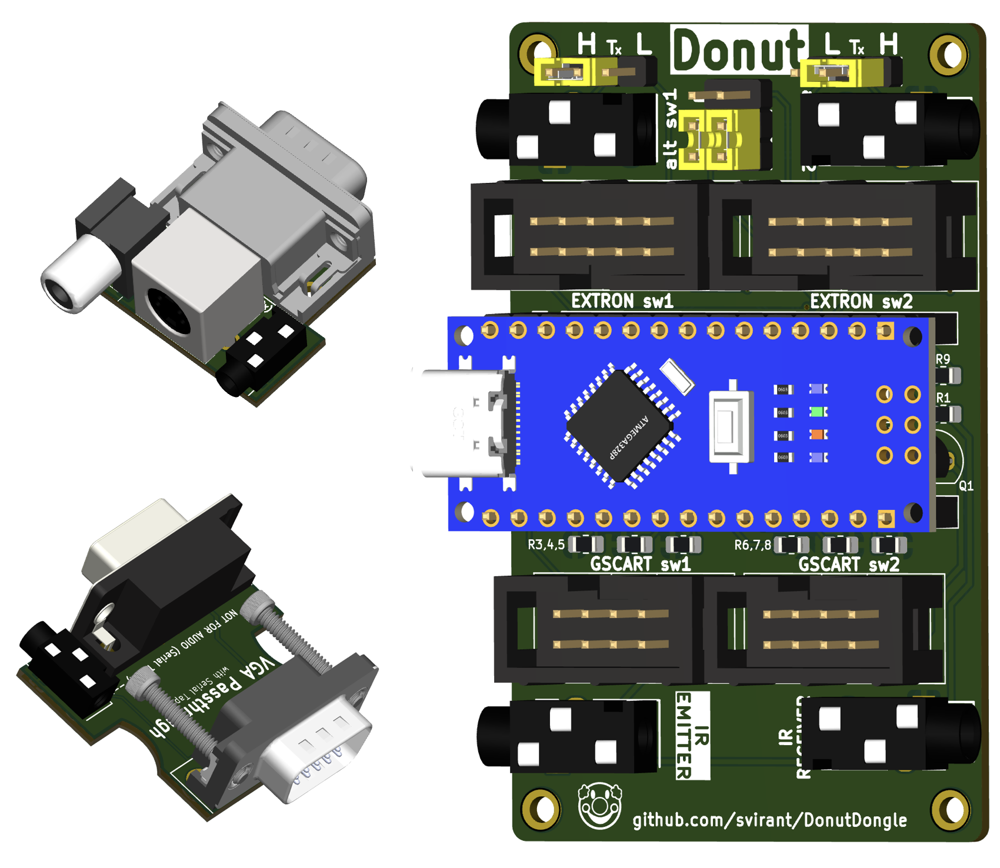
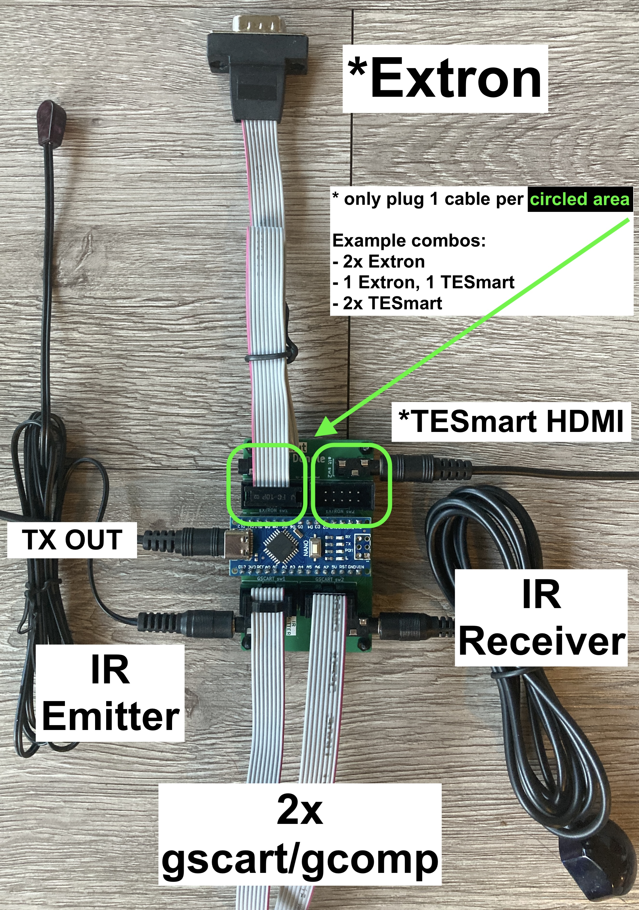
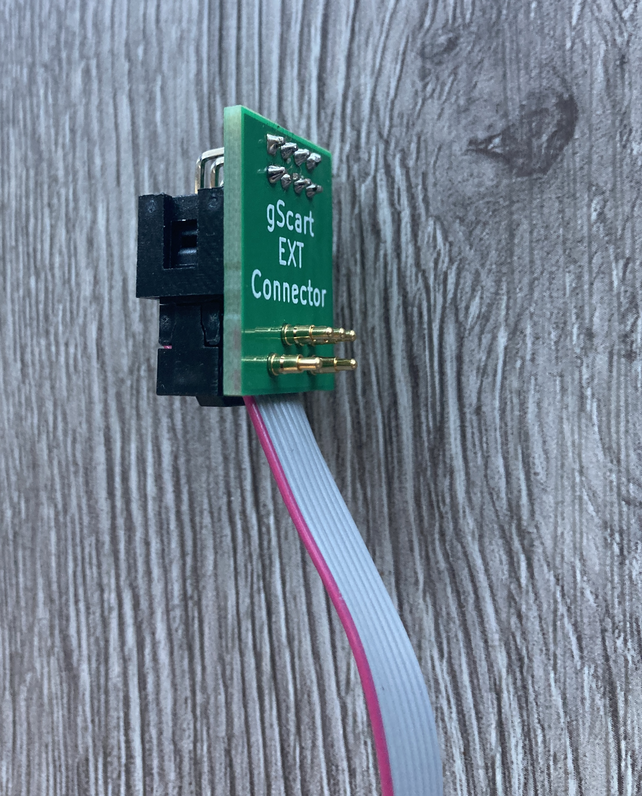
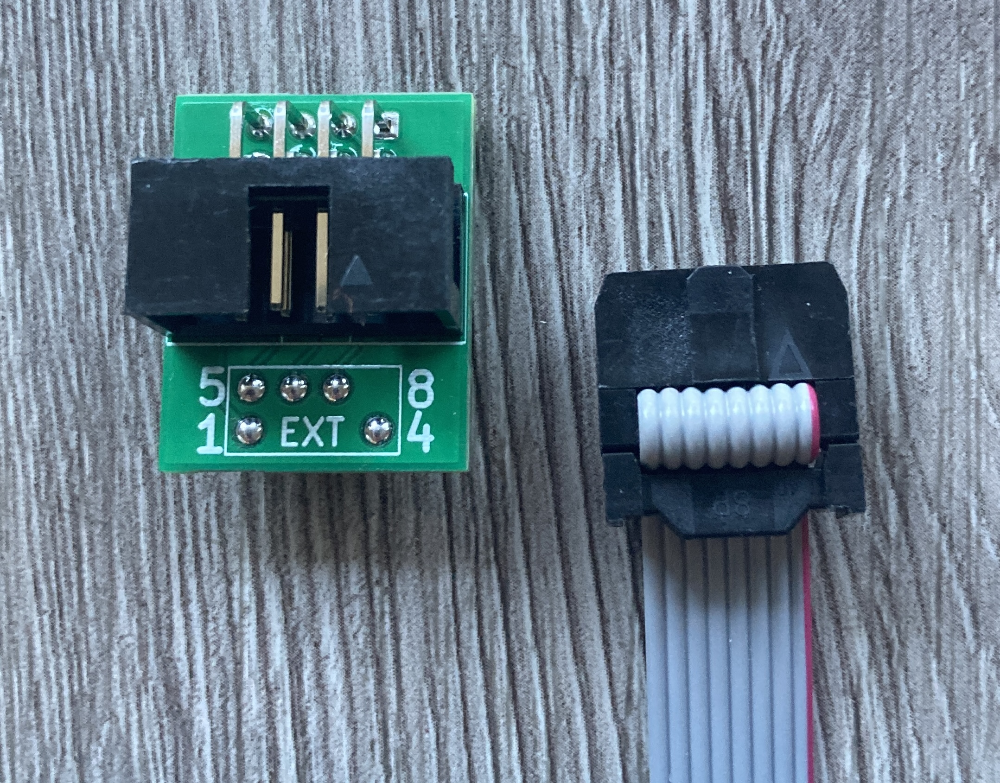
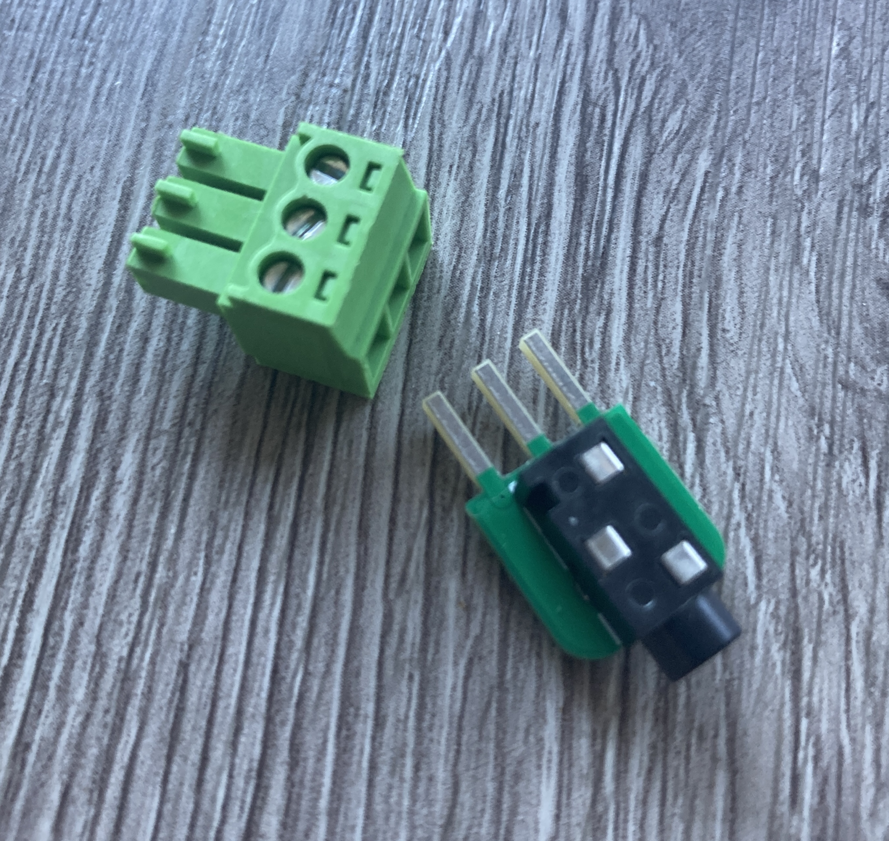
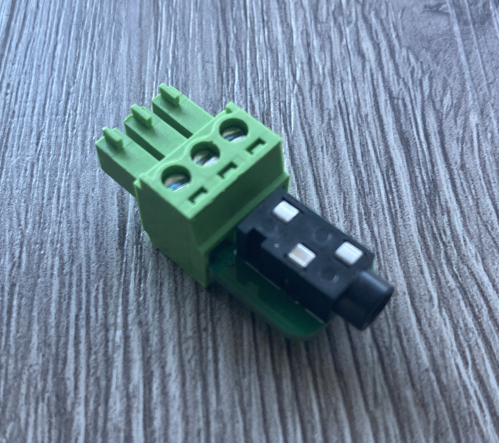
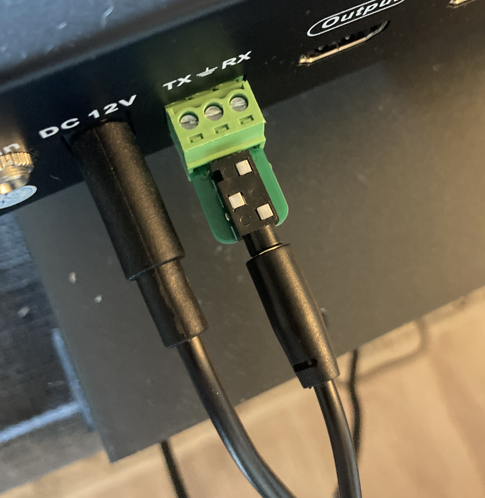
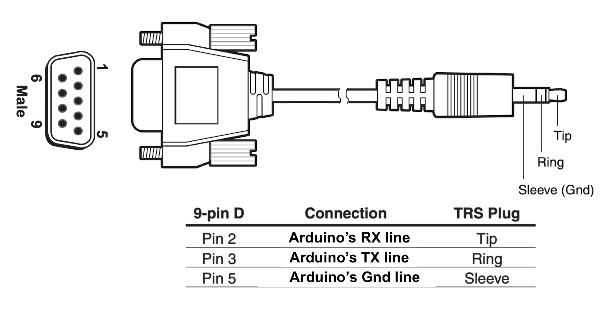
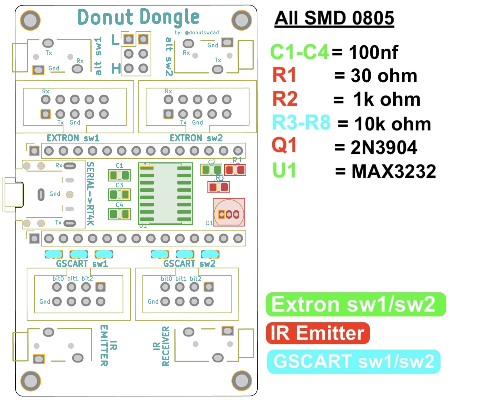
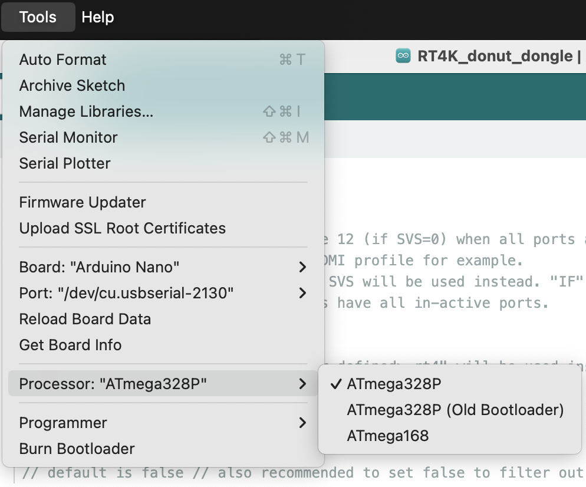

# Donut Dongle
**Arduino Nano based hub that connects your console switching setup with the RetroTink 4K and/or RetroTink 5x for Auto Profile switching**


<br />

The Donut Dongle connects to a switch in a way that allows it to see which port is active. When a console powers on (auto-switching) or an input is manually selected, the Donut Dongle sends a serial command to the RetroTink 4k (or IR signal to the RT5x) telling it to load a profile. The profiles can either be defined as remote profiles; those configured in the RT4K menu for the remote buttons. Or they can be SVS profiles which are configured on the RT4K's SDcard. <br />

For details, refer to the ["How to Use"](https://github.com/svirant/DonutDongle/tree/main/README.md#how-to-use) section below.
# Supported Switches
(current list, but not limited to)
| **Switch**    | Supported | Notes |
| ------------- | ------------- |------------- |
| Extron RGBHV sw6  | yes, confirmed first hand  | 
| TESmart 16x1 HDMI  | yes, confirmed first hand  |
| gSCARTsw / gCOMPsw | yes, confirmed by [@niquallis](https://x.com/niquallis), thanks so much for your help! | gSCARTsw tested, but gCOMPsw has the same underlying logic
| Extron CrossPoint, MVX, etc | if it supports SIS, should work fine, please let me know :) |
| Otaku Games Scart 10 | Jumper moved to "L" and with required [mod](https://github.com/svirant/RT4k_HD15_serial_control/tree/main/Otaku%20Games%20Scart%20Switch) | modded switch works on its own, but the Donut Dongle would allow you to connect 2x to the RT4K along with up to 2x gscart/gcomp

# Connections
  - Connect 4 switches Total
    - 2x gscart/gcomp
    - 2x Extron, 2x TESmart, or 1 of each
  - 1x usb-c port for power/programming (on Arduino Nano)
  - 1x 3.5mm "TX OUT to Retrotink 4K VGA adapter" port
  - 1x IR Emitter (optional for RT5x)
  - 1x IR Receiver (optional for better reception and IR remote customizations)


# Connection Acccessories

**gscart/gcomp EXT connector (plug-n-play)**<br />

<br />

**TESmart connector**<br />




**Alternate Extron connection type:**
   - **DB9 male to 3.5mm (connects to alt sw1 / alt sw2 port instead of 2x5 header)**
   - **Higher quality and much longer cord than the standard 2x5 cable**


**Parts listed in [BOM](https://github.com/svirant/DonutDongle/tree/main/README.md#connection-accessories) below**

----------------
# New IR Remote Control functionality
When using the optional IR Receiver, the IR reception of the RT4K can be been greatly enhanced. You can think of it as an IR repeater, but instead talks to the RT4K via Serial for solid communication. Since the Donut Dongle is in the middle, other remote features can be added such as:
 - AUX8 button + profile button 1 - 12 loads SVS profiles of your choosing. By default is SVS 1 - 12
 - AUX8 pressed twice, manually enter a SVS profile to load with the profile buttons using 1 - 9 and 10,11,12 buttons for 0. Must use 3 digits. Ex: 001 = 1, 010 = 10, etc

Let me know what ideas you have, and perhaps I can add them in.


# Assembly

Try out the [Interactive HTML BOM](https://svirant.github.io/DonutDongle/images/ibom.html))

[](https://svirant.github.io/DonutDongle/images/ibom.html)


## Bill of Materials (BOM)
### [- Digikey shared list](https://www.digikey.com/en/mylists/list/53XEHTQZJK)
### [- AliExpress wish list](https://www.aliexpress.com/p/wish-manage/share.html?smbPageCode=wishlist-amp&spreadId=09A40E28BA67E42DE9AF29A70E7238263DE305046632ABE9A0D5E1C5C4589AD9)
<br />

* **Donut Dongle PCB**

| **Qty**    | Designation | Part |  Link  |  Notes |
| ------------- | ------------- |------------- |------------- |------------- |
| 4  | C1-C4 | 0.1 uf / 100nf 0805 Capacitor| [Digikey](https://www.digikey.com/en/products/detail/yageo/CC0805KRX7R9BB104/302874?s=N4IgTCBcDaIMwEYEFokBYAMrkDkAiIAugL5A) | |
| 1  | R1 | 30 Ohm 0805 Resistor | [Digikey](https://www.digikey.com/en/products/detail/panasonic-electronic-components/ERJ-P06J300V/525250) | |
| 1  | R2 | 1K Ohm 0805 Resistor | [Digikey](https://www.digikey.com/en/products/detail/panasonic-electronic-components/ERJ-P06J102V/525197) | |
| 6  | R3-R8 | 10K Ohm 0805 Resistor | [Digikey](https://www.digikey.com/en/products/detail/panasonic-electronic-components/ERJ-6ENF1002V/111474) | |
| 1  | Q1 | 2N3904 NPN Transistor | [AliExpress](https://www.aliexpress.us/item/3256806623522970.html) | |
| 1  | U1 | MAX3232 SOP-16 RS-232 Interface IC | [AliExpress](https://www.aliexpress.us/item/3256807314260762.html) | |
| 1  | P1 | PJ-307 3.5mm Stereo Jack | [AliExpress](https://www.aliexpress.us/item/2251832712518602.html) | |
|    | |  or **1x** PJ-324M 3.5mm Audio Jack Socket | [AliExpress](https://www.aliexpress.us/item/2251832685563184.html) | |
| 4  | J4,J9-11 | PJ-320 3.5MM Headphone Jack Audio Video Female | [AliExpress](https://www.aliexpress.us/item/3256805995568762.html) | | 
| 2  | J3,J6 | 2x5 Pin Double Row 2.54mm Pitch Straight Box Header | [AliExpress](https://www.aliexpress.us/item/3256805177947724.html) | (Color: STRAIGHT TYPE, Pins: 10PCS DC3-10Pin) |
| 2  | J5,J8 | 2x4 Pin Double Row 2.54mm Pitch Straight Box Header | [AliExpress](https://www.aliexpress.us/item/3256805177947724.html) | (Color: STRAIGHT TYPE, Pins: 10PCS DC3-8Pin) |
| 1  | (optional) | 3.5mm CHF03 1.5 Meters IR Infrared Remote Emission Cable | [AliExpress](https://www.aliexpress.us/item/3256805962345169.html) | required for RT5X support |
| 1  | (optional) | 3.5mm Infrared Remote Control Receiver Extension Cable | [AliExpress](https://www.aliexpress.us/item/2251832741040177.html) | required for [New IR Remote Control functionality](https://github.com/svirant/DonutDongle?tab=readme-ov-file#new-ir-remote-control-functionality) |
| 2  | | 2.54mm Pitch Single Row Female 15P Header Strip | [AliExpress](https://www.aliexpress.us/item/3256801232229618.html) | |
| 1  | | Any 3.5mm / aux / stereo / trs / cable | [AliExpress](https://www.aliexpress.us/item/2255799962255486.html) | |
| 1  | | usb-c cable for Arduino power & initial programming | [AliExpress](https://www.aliexpress.us/item/3256806983355947.html) | |
| 1  | | Arduino Nano type c | Anywhere!, Amazon, or [AliExpress](https://www.aliexpress.us/item/3256806880365712.html) | (Color: TYPE-C USB 1pcs)|
| 1  | PH1 | 2x3 Pin Double Row 2.54mm Pitch Header | | Use the one that comes with the Arduino Nano |
| 2  | | 2.54mm Jumper | [AliExpress](https://www.aliexpress.us/item/2255800354403384.html) | You only need 2, but this comes in a pack of 100 :-/ |

* **Switch connection Cables**

| **Qty**    | Switch Type | Part |  Link  |  Notes |
| ------------- | ------------- |------------- |------------- |------------- |
| 1 or 2 | **TESmart HDMI** | Any 3.5mm / aux / stereo / trs / Cable | [AliExpress](https://www.aliexpress.us/item/2255799962255486.html) | |
| 1 or 2 | **GscartSW/GCompSW** | 2x4 Pin Double Row 2.54 Pitch Angled Box Header | [AliExpress](https://www.aliexpress.us/item/3256805177947724.html?) | (Color: RIGHT ANGLE TYPE, Pins: 10PCS DC3 8Pin), Solders onto EXT port. Or use the pogo-pin connector shown below.  |
|1 or 2 | **GscartSW/GCompSW** | 2x4 Pin Female Header Ribbon Cable | [AliExpress](https://www.aliexpress.us/item/3256804576275377.html?) | (Pins: 2x4Pin, Color: Any length) |
| 1  | **Extron** | 2 Port DB9 to 2x5 Pin Female Header Ribbon Cable | [AliExpress](https://www.aliexpress.us/item/3256807472891897.html) | |
| | | or **2x** DB9 Male to 3.5mm Male Serial RS232 Cable 6feet | [Amazon](https://www.amazon.com/LIANSHU-DC3-5mm-Serial-RS232-Cable/dp/B07G2ZL3SL/) | "MUST" be wired as so: [DB9 Male Pin 5 -> Sleeve, DB9 Male Pin 2 -> Tip, DB9 Male Pin 3 -> Ring](/images/7.png) |
 


### At least 1 of the following [VGA adapters](https://github.com/svirant/DonutDongle/tree/main/Adapters) is required:

* **YC2VGA w/ Serial Tap: (enhanced s-video and composite as a bonus)**

| **Qty**    | Part |  Link  |  Notes |
| ------------- | ------------- |------------- |------------- |
| 1  | Yellow RCA Composite jack | [AliExpress](https://www.aliexpress.us/item/3256805949533421.html) | (Color: Yellow) |
| 1  | S-Video jack | [AliExpress](https://www.aliexpress.us/item/3256804041313042.html) | (Color: A 4Pin) |
| 1  | PJ-320 3.5MM Headphone Jack Audio Video Female | [AliExpress](https://www.aliexpress.us/item/3256805995568762.html) | (Color: 10PCS PJ-320) |
| 1  | VGA Male Connector [10090926-P156XLF-ND] | [Digikey](https://www.digikey.com/en/products/detail/amphenol-cs-fci/10090926-P156XLF/4570100) | |
 
* **VGA Passthrough w/ Serial Tap:**

| **Qty**    | Part |  Link  |  Notes |
| ------------- | ------------- |------------- |------------- |
| 1 | VGA Male Connector [L717HDE15PD4CH4R-ND] | [Digikey](https://www.digikey.com/en/products/detail/amphenol-cs-commercial-products/L717HDE15PD4CH4R/4886543) | |
| 1 | VGA Female Connector | [AliExpress](https://www.aliexpress.us/item/3256806106796466.html) | (Color: HDR15P Female 3.08) |
| 1 | PJ-320 3.5MM Headphone Jack Audio Video Female | [AliExpress](https://www.aliexpress.us/item/3256805995568762.html) | (Color: 10PCS PJ-320) |
| 2 | #4-40 x 3/4" screw (optional) | [Ebay](https://www.ebay.com/itm/222577369468) | |

  ### Connection Accessories (optional)

  * **gscart/gcomp EXT connector**

| **Qty**    | Part |  Link  |  Notes |
| ------------- | ------------- |------------- |------------- |
| 1 | 2x4 Pin Double Row 2.54 Pitch Angled Box Header | [AliExpress](https://www.aliexpress.us/item/3256805177947724.html?) | (Color: RIGHT ANGLE TYPE, Pins: 10PCS DC3 8Pin) |
| 5 | Pogo-Pin | [Digikey](https://www.digikey.com/en/products/detail/mill-max-manufacturing-corp/0906-1-15-20-75-14-11-0/1147049) | |
   
  * **TESmart connector**

 | **Qty**    | Part |  Link  |  Notes |
| ------------- | ------------- |------------- |------------- |
| 1 | PJ-320 3.5MM Headphone Jack Audio Video Female | [AliExpress](https://www.aliexpress.us/item/3256805995568762.html) | (Color: 10PCS PJ-320) |

  -----------
# Programming an Arduino Nano
I recommend the [Official Arduino IDE and guide](https://www.arduino.cc/en/Guide) if you're unfamiliar with Arduinos. All .ino files used for programming are listed above. The following Libraries will also need to be added in order to Compile successfully.<br />
- **Libraries:**
  - <IRremote.h> Available through the built-in Library Manager under "Tools" -> "Manage Libraries..."
  - <AltSoftSerial.h>  Follow these steps to add AltSoftSerial.h
    - Goto https://github.com/PaulStoffregen/AltSoftSerial
    - Click the GREEN "<> Code" box and "Download ZIP"
    - In Arudino IDE; goto "Sketch" -> "Include Library" -> "Add .ZIP Library"

Some Arduino Nano's come with an Old Bootloader and won't Upload unless specified. **If you get errors** when trying to upload, swap to this option as a possible fix.



  -----------
# How to Use
- The following is from the .ino file itself. Refer to it directly for all Options and comments.
```
  /*
////////////////////
//    OPTIONS    //
//////////////////
*/


uint8_t SVS = 0; //     "Remote" profiles are profiles that are assigned to buttons 1-12 on the RT4K remote. "SVS" profiles reside under the "/profile/SVS/" directory 
             //     on the SD card.  This option allows you to choose which ones to call when a console is powered on.  Remote profiles allow you to easily change 
             //     the profile being used for a console's switch input if your setup is in flux. SVS require you to rename the file itself on the SD card which is 
             //     a little more work.  Regardless, SVS profiles will need to be used for console switch inputs over 12.
             //
             // **** Make sure "Auto Load SVS" is "On" under the RT4K Profiles menu. A requirement for most options ****
             //
             // 0 - use "Remote" profiles 1-12 for up to 12 inputs on 1st Extron Switch and SVS 13 - 99 for everything over 12. Only SVS profiles are used on 2nd Extron Switch if connected.
             //
             //     - remote profiles 1-12 for 1st Extron or TESmart Switch (If DP0 below is set to true - remote profile 12 is used when all ports are in-active)
             //     - SVS  12 - 99  for 1st Extron or TESmart (DP0 is true)
             //     - SVS  13 - 99  for 1st Extron or TESmart (DP0 is false)
             //     - SVS 101 - 199 for 2nd Extron or TESmart
             //     - SVS 201 - 208 for 1st gScart
             //     - SVS 209 - 216 for 2nd gScart
             //
             // 1 - use only "SVS" profiles.
             //     Make sure "Auto Load SVS" is "On" under the RT4K Profiles menu
             //     RT4K checks the /profile/SVS subfolder for profiles and need to be named: "S<input number>_<user defined>.rt4"
             //     For example, SVS input 2 would look for a profile that is named S2_SNES…rt4
             //     If there’s more than one profile that fits the pattern, the first match is used
             //
             //     - SVS   1 -  99 for 1st Extron or TESmart
             //     - SVS 101 - 199 for 2nd Extron or TESmart
             //     - SVS 201 - 208 for 1st gScart
             //     - SVS 209 - 216 for 2nd gScart
             //     - SVS   0       for DP0 option mentioned below
             //
             //  ** If DP0 below is set to true, create "S0_<user defined>.rt4" for when all ports are in-active. Ex: S0_DefaultHDMI.rt4
             //
             // 2 - use "Remote" profiles 1-12 for gscart/gcomp switches. Remote profile 1-8 for 1st gscart switch, 9-12 for inputs 1-4 on 2nd gscart switch.
             //     inputs 5-8 on the 2nd gscart switch will use SVS profiles 213 - 216
             //
             //     - remote profiles 1-8 for 1st gScart, 9 - 12 for first 4 inputs on 2nd gScart (If DP0 below is set to true - remote profile 12 is used when all ports are in-active)
             //     - SVS 213 -  216 for remaining inputs 5 - 8 on 2nd gScart 
             //     - SVS   1 -  99 for 1st Extron or TESmart
             //     - SVS 101 - 199 for 2nd Extron or TESmart
             //
             //
             //


bool DP0  = false;       // (Default Profile 0) 
                         //
                         //
                         // set true to load "Remote" profile 12 (if SVS=0) when all ports are in-active on 1st Extron switch (and 2nd if connected). 
                         // You can assign it to a generic HDMI profile for example.
                         // If your device has a 12th input, SVS will be used instead. "IF" you also have an active 2nd Extron Switch, remote profile 12
                         // will only load if "BOTH" switches have all in-active ports.
                         // 
                         // 
                         // If SVS=1, /profile/SVS/ "S0_<user defined>.rt4" will be used instead of remote profile 12
                         //
                         // If SVS=2, remote profile 12 will be used for gscart/gcomp
                         //
                         //
                         // default is false // also recommended to set false to filter out unstable Extron inputs that can result in spamming the RT4K with profile changes 
                       


uint8_t voutMatrix[65] = {1,  // MATRIX switchers // by default ALL input changes to any/all outputs result in a profile change
                                                   // disable specific outputs from triggering profile changes
                                                   //
                           1,  // output 1 (1 = enabled, 0 = disabled)
                           1,  // output 2
                           1,  // output 3
                           1,  // output 4
                           1,  // output 5
                           1,  // output 6
                           1,  // output 7
                           1,  // output 8
                           1,  // output 9
                           1,  // output 10
                           1,  // output 11
                           1,  // output 12
                           1,  // output 13
                           1,  // output 14
                           1,  // output 15
                           1,  // output 16
                           1,  // output 17
                           1,  // output 18
                           1,  // output 19
                           1,  // output 20
                           1,  // output 21
                           1,  // output 22
                           1,  // output 23
                           1,  // output 24
                           1,  // output 25
                           1,  // output 26
                           1,  // output 27
                           1,  // output 28
                           1,  // output 29
                           1,  // output 30
                           1,  // output 31
                           1,  // output 32 (1 = enabled, 0 = disabled)
                               //
                               // ONLY USE FOR 2ND MATRIX SWITCH
                           1,  // 2ND MATRIX SWITCH output 1 (1 = enabled, 0 = disabled)
                           1,  // 2ND MATRIX SWITCH output 2
                           1,  // 2ND MATRIX SWITCH output 3
                           1,  // 2ND MATRIX SWITCH output 4
                           1,  // 2ND MATRIX SWITCH output 5
                           1,  // 2ND MATRIX SWITCH output 6
                           1,  // 2ND MATRIX SWITCH output 7
                           1,  // 2ND MATRIX SWITCH output 8
                           1,  // 2ND MATRIX SWITCH output 9
                           1,  // 2ND MATRIX SWITCH output 10
                           1,  // 2ND MATRIX SWITCH output 11
                           1,  // 2ND MATRIX SWITCH output 12
                           1,  // 2ND MATRIX SWITCH output 13
                           1,  // 2ND MATRIX SWITCH output 14
                           1,  // 2ND MATRIX SWITCH output 15
                           1,  // 2ND MATRIX SWITCH output 16
                           1,  // 2ND MATRIX SWITCH output 17
                           1,  // 2ND MATRIX SWITCH output 18
                           1,  // 2ND MATRIX SWITCH output 19
                           1,  // 2ND MATRIX SWITCH output 20
                           1,  // 2ND MATRIX SWITCH output 21
                           1,  // 2ND MATRIX SWITCH output 22
                           1,  // 2ND MATRIX SWITCH output 23
                           1,  // 2ND MATRIX SWITCH output 24
                           1,  // 2ND MATRIX SWITCH output 25
                           1,  // 2ND MATRIX SWITCH output 26
                           1,  // 2ND MATRIX SWITCH output 27
                           1,  // 2ND MATRIX SWITCH output 28
                           1,  // 2ND MATRIX SWITCH output 29
                           1,  // 2ND MATRIX SWITCH output 30
                           1,  // 2ND MATRIX SWITCH output 31
                           1,  // 2ND MATRIX SWITCH output 32 (1 = enabled, 0 = disabled)
                           };
                           


uint8_t RT5Xir = 1;      // 0 = disables IR Emitter for RetroTink 5x
                     // 1 = enabled for Extron sw1 switch, TESmart HDMI, or Otaku Games Scart Switch if connected
                     //     sends Profile 1 - 10 commands to RetroTink 5x. Must have IR LED emitter connected.
                     //     (DP0 - if enabled uses Profile 10 on the RT5X)
                     //
                     // 2 = enabled for gscart switch only (remote profiles 1-8 for first gscart, 9-10 for first 2 inputs on second gscart)

uint8_t RT4Kir = 0;      // 0 = disables IR Emitter for RetroTink 4K
                     // 1 = enabled for Extron sw1 switch, TESmart HDMI, or Otaku Games Scart Switch if connected
                     //     sends Profile 1 - 12 commands to RetroTink 4K. Must have IR LED emitter connected.
                     //     (DP0 - if enabled uses Profile 12 on the RT4K)
                     //
                     // 2 = enabled for gscart switch only (remote profiles 1-8 for first gscart, 9-12 for first 4 inputs on second gscart)


uint8_t auxprof[12] =    // Assign SVS profiles to IR remote profile buttons. 
                          // Replace 1, 2, 3, etc below with "ANY" SVS profile number.
                          // Press AUX8 then profile button to load. Must have IR Receiver connected and Serial connection to RT4K.
                          // 
                     {1,  // AUX8 + profile 1 button
                      2,  // AUX8 + profile 2 button
                      3,  // AUX8 + profile 3 button
                      4,  // AUX8 + profile 4 button
                      5,  // AUX8 + profile 5 button
                      6,  // AUX8 + profile 6 button
                      7,  // AUX8 + profile 7 button
                      8,  // AUX8 + profile 8 button
                      9,  // AUX8 + profile 9 button
                      10, // AUX8 + profile 10 button
                      11, // AUX8 + profile 11 button
                      12, // AUX8 + profile 12 button
                      };
```
