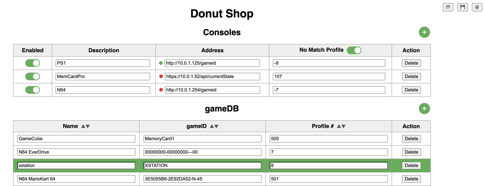
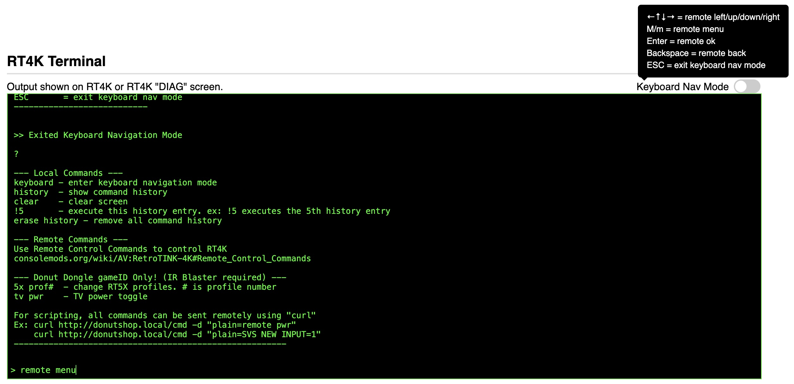

<br />
<br />

## gameID devices currently supported
| **Device**    | Supported | Notes |
| ------------- | ------------- |------------- |
|PS1Digital | yes, confirmed first hand | |
|N64Digital | yes, confirmed first hand | |
|RetroGEM N64 | yes | |
|RetroGEM PS1 | yes | |
| MemCardPro 2 | yes, for GameCube, PS1, & PS2 | MemCardPro 2.0+ firmware requires https instead of http |
| Fenrir ?| | |
| more on the way... |  

### LED activity
| **Color**    | Blinking | On | Notes |
| ------------- | ------------- |------------- |------------- |
| 🟠| | Wifi not connected | After 2 minutes of unsuccessfully connecting, "DonutShop_Setup" Wifi AP will reappear to help with reconnection. |
| 🔵| WiFi active, querying gameID addresses| Longer blinks represent an unsuccessful query of gameID address. Usually a powered off console in the list.| After initial power, no BLUE light means WiFi not found. |
| 🟢| 1 second blink is gameID match found and SVS profile being sent to RT4K | |  | 
| 🔴| | Power| No way to control as it's hardwired in. May just need to cover with tape. |

## Flashing 
1. Download the latest ```.bin``` files listed above
2. Open [ESP Tool](https://espressif.github.io/esptool-js/) in Chrome, Brave, or Edge
3. Connect your Arduino Nano ESP32 via USB and double click the RST button immediately following to enter **recovery mode** (a GREEN led will strobe when successful)
4. Click **Connect** and select your device (typically starts with USB JTAG)
   - You may first need to connect to "Nano ESP32" and refresh the page for "USB JTAG" to appear in the Connect menu. 
5. Click **Erase Flash** to format your device (required for LittleFS)
6. Set Flash Address to **0x0** and Choose the downloaded file ```Donut_Dongle_gameID_Full_vXXX.bin``` (not _Update.bin)
7. Click **Add File**, set the next Flash Address to **0xF70000**, Choose ```nora_recovery.bin```
8. Click **Program**
9. Once complete, reconnect the USB cable of the device and continue **Setup** below...

## Setup
1. Upon reconnecting the USB cable, your board should **Successfully boot DonutShop** and leave you with an ORANGE led.
2. With your computer or smartphone, join the broadcasted ```DonutShop_Setup``` WiFi to connect it to your home network.
3. Follow the instructions listed and once complete, you should see a BLUE led indicating it's connected to WiFi and looking for addresses to connect to. If the BLUE led does not show, press the RST button one time.
4. You should now be able to visit http://donutshop.local to add Consoles and gameIDs.
5. For all future changes/uploads you can use the "Firmware Update" section in Settings to apply the latest listed _Update.bin file. Using the _Full.bin file for updates will not work.
   
## General Setup

For Consoles, quickest if IP address is used versus Domain address:
  - Ex: http://10.0.1.10/gameid vs http://ps1digital.local/gameid 

If you have multiple consoles on when DonutShop is booting, the console furthest down the list wins. If more than 2 consoles are active when one is powered off, the console that was on prior takes over. (Order is remembered.)<br>

## Adding gameIDs, Consoles, and other Options

The Web UI allows you to live update the Consoles and gameID table. You no longer have to reflash for changes. You can also now import and export your config if anything were to happen and you need to rebuild.

## WiFi setup
**ONLY** compatible with **2.4GHz** WiFi APs. Configured during initial setup process. If you need to change SSID or password, the "DonutShop_Setup" AP will reappear after 2 minutes of not being able to connect.

## New IR Remote Control functionality
When using the optional IR Receiver, the IR reception of the RT4K can be been greatly enhanced. You can think of it as an IR repeater, but instead talks to the RT4K via Serial for solid communication. Since the Donut Dongle is in the middle, other remote features can be added such as:
 - **Alternate SVS Profiles**: Have you ever wanted to add CRT effects to all of your existing SVS profiles? Or wanted all your profiles to output at 1080p instead of 4K? With this feature you can create a set of SVS profiles that have these changes and activate the system with the remote. Pressing the "SAFE" button twice + 1 - 9 buttons will allow you to configure 9 different sets of these profiles per regular profile to load instead of the regular one you created. For example: Instead of SVS profile S1_SNES.rt4 loading, S1001_SNES.rt4 will load instead after activating with the "SAFE"x2 + 1 button. Here are some more examples so you can see the pattern used for creating these: </br>

    "SAFE"x2 + x button = Sx001_SNES-CRT.rt4, where x is the number button selected and 001 is the S1_ profile represented in 3 digits. </br>
    "SAFE"x2 + 2 button = S2001_SNES-1080p.rt4 </br>
    "SAFE"x2 + 3 button = S3001_SNES-Zoomed.rt4 </br>
    "SAFE"x2 + 4 button = S4001_SNES.rt4 </br>
    "SAFE"x2 + 5 button = S5001_SNES.rt4 </br>
    "SAFE"x2 + 6 button = S6001_SNES.rt4 </br>
    "SAFE"x2 + 7 button = S7001_SNES.rt4 </br>
    "SAFE"x2 + 8 button = S8001_SNES.rt4 </br>
    "SAFE"x2 + 9 button = S9001_SNES.rt4 </br> 

   - The name following the "\_" can be changed as well. So a name like S1001_SNES-CRT.rt4 can be used to better describe. Only the naming pattern before the "\_" is important. </br>

   - When SVS profile S2 normally would load, Sx002 would load instead where x = the number button chosen prior and 002 represents the S2 profile. S2100_NES.rt4 for example would be the 2nd Alternate profile for S100_NES.rt4. It's up to you to create these alternate sets of profiles on your SD card of course. To disable this feature and return to your normally configured profiles, press "SAFE"x2  + 10, 11, or 12 buttons on the remote.

 - SAFE button once + profile button 1 - 12 loads SVS profiles of your choosing. By default is SVS 1 - 12. Configured with auxprof[] in the Settings section of the .ino
  
 - Normally, if you power on your console before waking the RT4K, the RT4K will have not seen the profile change. Using the remote's POWER button, in this configuration, will wake the RT4K "and" resend the profile after it's finished waking.

 - AUX8 button + Power button power cycles your TV via IR Emitter. (only LG OLED CX atm, more can be added upon request)

 - AUX8 pressed twice, manually enter a SVS profile to load with the profile buttons using 1 - 9 and 10,11,12 buttons for 0. Must use 3 digits. Ex: 001 = 1, 010 = 10, etc

 - AUX8 pressed 3x will perform the standard AUX8 action

 - AUX5 will load the previous profile. Repeated presses will switch back/forth the last 2 profiles. Great for A/B comparisons.
 
 - MT-ViKI 8 Port HDMI switch's inputs can be changed. Must configure "MTVir" in the options section of the .ino
    - AUX7 + button 1 - 8 for inputs 1 - 8 on "alt sw1" port (SVS profiles 1 - 8)
    - AUX8 + button 1 - 8 for inputs 1 - 8 on "alt sw2" port (SVS profiles 101 - 108)

 - TESmart 16x1 HDMI switch's inputs can changed. Must set "TESmartir" in the options section.
    - AUX7 + button 1 - 12, aux1, aux2, aux3, aux4 for inputs 1 - 16 on "alt sw1" port (SVS profiles 1 - 16)
    - AUX8 + button 1 - 12, aux1,aux2,aux3,aux4 for inputs 1 - 16 on "alt sw2" port (SVS profiles 101 - 116)


## [Advanced] Programming the Arduino Nano ESP32 with custom .ino changes
I recommend the [Official Arduino IDE and guide](https://docs.arduino.cc/software/ide-v2/tutorials/getting-started-ide-v2/) if you're unfamiliar with Arduinos. All .ino files used for programming are listed above. The following Libraries will also need to be added in order to Compile successfully.<br />
- **Add Additional Boards**
  - In the Arduino IDE open up "Settings", find the section "Additional boards manager URLs:"
  - Add in: https://espressif.github.io/arduino-esp32/package_esp32_index.json and select "OK"
1. First, you must have completed the steps shown in the "Flashing" section above at least once before continuing.
2. "Double click" the RST button right after connecting to your PC/Mac to put into "recovery mode". You'll see a GREEN led strobe if successful.
3. Open up Donut_Dongle_gameID.ino in the Arduino IDE to make your custom changes.
4. Under the "Tools" menu, make sure...
- Board - "esp32" -> "Arduino Nano ESP32" is selected. DO NOT select "Arduino ESP32 Boards" -> "Arduino Nano ESP32"
- Port - The listed "Serial" port is chosen, not dfu one.
    - If Donut_Shop is currently running, you should also see a "DonutShop" Network Port that connects via WiFi.
- Core Debug Level - "None"
- Partition Scheme - "With SPIFFS partition (advanced)" is chosen
- Pin Numbering - "By Arduino pin (default)"
- USB Mode - "Debug mode (Hardware CDC)" / **Important that this is selected!**
5. To flash the changes, select "Sketch" -> "Upload"
